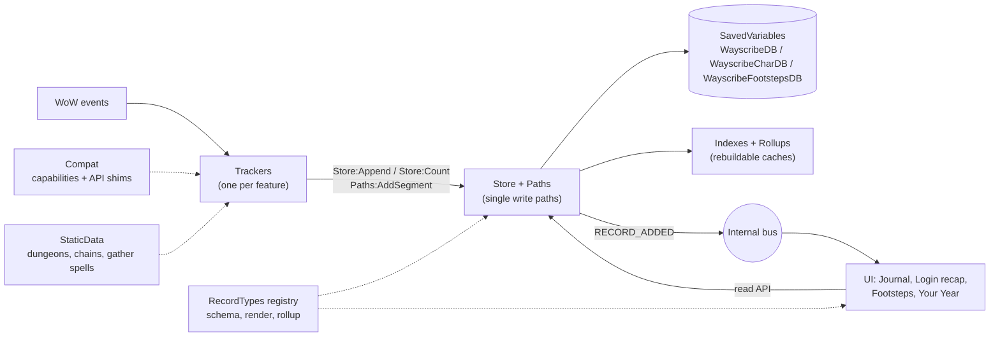

# Wayscribe architecture

How Wayscribe is built, and why. Wayscribe is an automatic, per-character journal for **WoW
Forever**: it records what happens while you play, groups it by day, and powers a login recap, the
**Footsteps** travel map and **Your Year**, a yearly recap. Next to what it records, the player keeps
their own **notes** in it, and a note can mark a place on the world map. What it does for players is in the
[README](../README.md); how to run the tests and try a build is in [DEVELOPMENT.md](DEVELOPMENT.md).

Code comments cite this document by section (`docs/ARCHITECTURE.md §4.6`), so the section numbers
stay put.

---

## 1. Design principles

These six rules drive every decision below. If a future feature conflicts with one of them, change the
feature, not the rule.

1. **Store facts, derive narratives.** We persist small, typed facts (`LEVEL_UP {level=12}`), never
   finished sentences. Text, "first time" badges, rollups and recaps are computed from facts. This keeps
   the DB small and localizable, and lets a later release reinterpret old data. For example, a new
   quest-chain definition can light up chains that were completed months ago.
2. **One write path.** Trackers never touch SavedVariables. Every journal write goes through `Store`,
   every Footsteps trail through `Paths`; both validate, partition and broadcast what they keep.
3. **Never destroy data you don't understand.** If loading or migrating fails, or the data comes from a
   newer addon version, the addon goes **read-only (safe mode)**. Because the client saves whatever is
   in memory on logout, a crash at load followed by a "fresh start" would wipe the journal. Safe mode
   prevents that.
4. **Detect capabilities, not flavors.** Forever runs the Mainline engine but ships Vanilla content, and
   its `WOW_PROJECT_ID` has already changed once during the beta (1 in early builds, 18 in build 70235).
   Branching on flavor broke AutoPotion (`a70aac7`). Code asks `Compat.has.X`, never `isRetail`.
5. **Pay only for what's enabled.** A disabled tracker unregisters all of its events. Context-only events
   (roster, encounters) are registered only while that context is active, for example inside an instance.
6. **Failures stay local.** Each tracker runs in an error boundary. A broken tracker logs itself, disables
   itself and leaves the rest of the addon running.

### Hard constraints of the platform

| Fact | Consequence for the design |
|---|---|
| SavedVariables (SV) are loaded once before `ADDON_LOADED` and written **only** on clean logout or `/reload`. There is no flush API. | Everything lives in memory during play. A client crash loses that session, and nothing can prevent it. Writes are cheap table inserts. |
| SV files are Lua source parsed at login. Many small tables and unique constants are slow to load, and very large SV files have historically hit `constant table overflow`. | Bulk data (Footsteps trails) is **string-packed**. Records stay compact. Old data can move to a load-on-demand archive. |
| `SavedVariablesPerCharacter` loads only the current character's file. | The journal is per-character by nature, so it gets automatic partitioning for free. |
| Metatables, functions and userdata are not saved. | The SV tables hold plain data only. Behavior lives in modules that read and write those tables. |
| **Confirmed:** registering `COMBAT_LOG_EVENT_UNFILTERED` on Forever triggers a protected-action popup (ForeverChronicle had to remove it). | **Never register CLEU.** Use high-level events such as `ENCOUNTER_END`, `BOSS_KILL`, `PLAYER_LEVEL_UP`, `QUEST_TURNED_IN` and `LOOT_*`. |
| **Confirmed:** Forever has Midnight-style **secret values** (`issecretvalue` exists). Spellcast event arguments, aura data, and some unit, map and quest values can be secret at times. Comparing, concatenating or storing a secret value raises an error. | Every game value passes `Compat.Safe(v)` at the tracker boundary: it returns `nil` for secrets and wrong types. `Store` validation rejects secrets as a second line of defense. A missing value degrades the record, never the session. |
| **Reported:** early Forever beta builds wrote SavedVariables to disk but sometimes didn't restore them at the next startup. According to a Blizzard forum report, this stopped from client build `1.60.1.70009`. | A missing character DB is never silently treated as a first install while there's evidence that data existed (see §4.6, missing-DB guard). The client build is stored in `meta` for diagnosis. |

---

## 2. Layer overview



| Layer | Responsibility | May depend on |
|---|---|---|
| **Core** | Namespace, lifecycle, module base, event frames, internal bus, error boundary, logging, time/day keys, geometry (pure math on trails) | — |
| **Compat** | Capability detection (`Compat.has.*`), thin API shims (position, professions, instance info), `/ws probe` | Core |
| **Data** | `Store`, `Paths` (Footsteps trails), `Notes` (the player's notes), `Schema` (migrations, safe mode), `RecordTypes`, `Index`, `Players` (interning), `Codec`, `Coverage` (share of Azeroth walked), `YearCards` (Your Year's card registry), `Backup` (the restorable backup string) | Core, Compat |
| **StaticData** | Plain tables: dungeon → final encounter, quest chains, gather and travel spell IDs, English map names | — |
| **Trackers** | Translate game events into facts, holding only the minimal state they need | Core, Compat, Data (write API), StaticData |
| **UI** | Journal window with Your Year and Notes, login recap, settings, minimap, keybind, Footsteps map, notes on the map, export, backup and restore | Core, Data (read API, `Notes` to write the player's notes), RecordTypes |

Dependencies point one way only. UI never calls trackers, and trackers never call UI. They talk through
the Store and the bus. The one write the UI makes is the player's own notes, through `Notes` (§4.9).

---

## 3. Core runtime

### 3.1 Lifecycle

| Event | What happens |
|---|---|
| `ADDON_LOADED` (ours) | `Schema:Load()` creates or migrates the three SV tables, decides on safe mode and builds the in-memory indexes. |
| `PLAYER_LOGIN` | Resolve `Compat` capabilities. Enable each tracker whose setting is on. Register settings, minimap button and slash commands. |
| `PLAYER_ENTERING_WORLD(isInitialLogin, isReloadingUi)` | The Session tracker starts or resumes a session. The login recap is shown if this is the initial login and the first one of the day. |
| `PLAYER_LOGOUT` | Close open sessions, segments and runs, and stamp `lastSeen`. This handler must be tiny and must not error, because it is the last chance to write before the SV file is saved. |

### 3.2 Modules and event dispatch

- A **Module** base class gives each tracker its own hidden event frame plus
  `self:RegisterEvent(ev)`, `self:RegisterUnitEvent(ev, "player")` and `self:UnregisterAllEvents()`.
  The client dispatches natively, so we don't need a central fan-out loop. With per-module frames,
  `RegisterUnitEvent` filters never collide.
- Handlers are `self[event](self, ...)`, called through `xpcall` with our error handler, which feeds the
  [error boundary](#34-error-boundary).
- Use `RegisterUnitEvent(..., "player")` for every `UNIT_*` event. Otherwise the event fires for every
  nameplate and party member.
- Trackers with **context-scoped events** subscribe on context enter and unsubscribe on context exit.
  For example, the Dungeon tracker registers `ENCOUNTER_END` and `GROUP_ROSTER_UPDATE` only while inside
  an instance.

### 3.3 Internal bus and timing

- A tiny callback registry (`Core/Bus.lua`); each listener runs in its own error boundary. Messages:
  `READY`, `LOGOUT` (sent before the canary is stamped, so what it writes is counted), `SAFE_MODE`,
  `RECORD_ADDED`, `COUNTER_CHANGED`, `SETTINGS_CHANGED`, `ITEM_NAMES_LOADED`, `REBUILT` (after
  `/ws rebuild`, so trackers can derive what older facts imply, §6.7), the Footsteps messages
  `PATH_ADDED`, `PATH_LIVE`, `PATH_POINT` and `PATH_WIPED` (§6.8), `COVERAGE_READY` (a background
  measurement finished, §6.8), `RECAP_HIDDEN` (Your Year's prompt waits for the login recap, §8) and
  `NOTES_CHANGED` (a note was added, changed or deleted, §4.9).
- UI refresh is **coalesced**: a pending flag plus one `C_Timer.After(0, ...)`, so 20 loot events
  produce one redraw.
- Noisy events (`SKILL_LINES_CHANGED` and friends) are **debounced** (`Module:Debounce`): one snapshot,
  ~0.5 s after the burst.
- Long work (drawing trails, measuring coverage, making or checking a backup) runs in a coroutine with
  a budget of 4 to 10 ms per frame, so it never stalls the game.

### 3.4 Error boundary

- Errors are written to a ring buffer in `WayscribeDB.log` (last 50 entries, each with timestamp, module,
  message and trimmed stack). `/ws log` shows them.
- A module that errors 10 times in one session is disabled for the rest of the session, with a single
  chat notice.
- In developer mode (`/ws dev`), errors are also forwarded to `geterrorhandler()` so BugSack sees them.
- What the guards find in the saved data (a journal that didn't load, a rename, a newer version, an
  unexpected shape, a pasted backup the addon can't take) is a **warning** (`Log:Warn`): it goes to
  the log only, since it is the player's situation, not a bug, and the banner already explains it. A
  migration that throws is an error.

### 3.5 Time

- All timestamps are `time()` epoch seconds.
- Day key: integer `YYYYMMDD` (`20261003`). Month key: `YYYYMM`. Both are computed from local time when
  the record is written. Days roll over at **calendar midnight**. There's no configurable rollover
  hour, so a day key never depends on a setting.
- Short dates (login recap) follow a setting: locale default (deDE → `03.10.2026`) or a manual
  override. Journal pages spell the date out from locale tables, because `date("%A")` is always
  English in the client: "Saturday, October 3, 2026" / "Samstag, 3. Oktober 2026". The weekday is
  computed from the day key (Sakamoto's method), so it needs no `time()` call.
- Times of day follow the game's 24-hour clock setting (`timeMgrUseMilitaryTime`), else the
  language's habit (enUS `2:05 PM`, deDE `14:05`).

---

## 4. Data layer

The data layer is the most important part of the addon and gets the most tests.

### 4.1 SavedVariables split

| SV | Scope | Contents | Why separate |
|---|---|---|---|
| `WayscribeDB` | Account | Settings, minimap position, error log, per-character canaries (§4.6) | Small. Shared across characters. A separate file, so it can vouch for the character files. |
| `WayscribeCharDB` | Character | Journal records, counters, sessions, indexes, tracker state, the player's notes | The core data. |
| `WayscribeFootstepsDB` | Character | Footsteps trails (string-packed), written only through `Paths` | The largest and fastest-growing data. Isolating it means it can be wiped, pruned or moved to load-on-demand without touching the journal. It has its own schema version and read-only guard (§4.6). It lives in the same file as the journal (one `Wayscribe.lua` per character), so a file that fails to load takes both. |

### 4.2 `WayscribeCharDB` layout

```lua
WayscribeCharDB = {
    schema = 1,                         -- migration version (see 4.6)
    meta = {
        guid = "Player-…", name = "…", realm = "…", class = "MAGE", race = "Troll",
        created = 1759400000,           -- first time the addon saw this character
        seq = 1234,                     -- last issued record id (monotonic)
        rollup = 2,                     -- version of the rollups' shape (§4.5)
        addonVersion = "0.2.0",         -- last version that wrote this DB
    },

    -- Resumable tracker state (survives /reload and relog)
    state = {
        session      = { m = 202610, i = 1 },              -- the open session: month + index
        level        = 12,
        professions  = { [186] = { rank = 52, max = 75, name = "Mining" } },  -- snapshot (§6.3)
        activeRun    = { instanceID = 389, name = "Ragefire Chasm", start = 1759490500,
                         bosses = { 2732, 2733 }, killedAt = { [2732] = 1759490800, … },
                         roster = { 3, 7 }, left = nil, completed = nil },     -- §6.6
        lastCleared  = { instanceID = 389, ts = 1759493000 },
        lastRecapDay = 20261003,                           -- login popup bookkeeping (§7)
    },

    -- Interned players (records hold small integers instead of names). Forever's names include the
    -- surname ("Xy Ashford"); their realm isn't known, so it's left out.
    players = {
        [3] = { guid = "Player-…", name = "Xy Ashford", class = "PRIEST" },
    },

    -- Partitioned journal: month -> day -> records + counters
    months = {
        [202610] = {
            days = {
                [20261003] = {
                    records = {
                        { id = 1201, ts = 1759490900, type = "DUNGEON_COMPLETED", v = 1,
                          data = { instanceID = 389, roster = { 3, 7 }, dur = 2710 }, first = true },
                        { id = 1202, ts = 1759493100, type = "LEVEL_UP", v = 1,
                          data = { level = 12, map = 1411 } },
                    },
                    counters = {                  -- high-frequency facts are aggregated, not listed
                        gather = { [2770] = 23, [2835] = 4 },     -- itemID -> count
                        nodes  = { mining = 12 },
                        quests = { [840] = 1, [841] = 1 },        -- questID -> turned in today
                    },
                },
            },
            sessions = { { s = 1759489000, e = 1759497000 } },
            rollup   = { records = { LEVEL_UP = 2, DUNGEON_COMPLETED = 1 },   -- count per type
                         counters = { gather = { [2770] = 23 } },              -- the days' counters summed
                         activeDays = 1, firsts = 1,                           -- generic (Index)
                         minLevel = 11, maxLevel = 12, maxLevelAt = 1759493100, -- type-specific
                         dungeons = { [389] = 1 }, dungeonNames = { [389] = "Ragefire Chasm" },
                         dungeonFirsts = { [389] = 1759490900 }, companions = { [3] = 1, [7] = 1 } },
        },
    },

    firsts = { ["DUNGEON:389"] = 1201, ["PROF:186"] = 1103 },   -- first-occurrence index

    -- The player's own notes (§4.9); each /way line of a text is a marker on the world map.
    notes = {
        seq = 2,                        -- last issued note id (monotonic)
        list = {
            { id = 1, created = 1759490000, edited = 1759490200, title = "Buy linen", text = "…" },
            { id = 2, created = 1759493000, edited = 1759493100, title = "Hidden Books", icon = 3,
              text = "/way Elwynn Forest 49.0 86.4 The Kaldorei\n/way 52.3 41.0 Upstairs" },
        },
    },
}
```

Why this shape:

- **Month and day partitions** keep every read and write bounded. Rendering a day touches one table.
  The yearly recap touches 12 rollups. Moving a closed year into an archive moves whole month tables,
  with no per-record migration.
- **Records vs counters.** A *record* is something worth its own journal line, such as a level-up, a
  dungeon or a boss. A *counter* is something that happens a lot, such as ore looted or quests turned in.
  Counters are summed per day and shown as one summary line ("Gathered 23× Copper Ore, 4× Rough Stone").
  This keeps the DB small. The rule of thumb: a new tracker that would emit more than ~20 records per hour
  should use counters.
- Records carry `v` (the record-type version) so renderers can handle or upcast older shapes.
- **Player interning:** dungeon groups repeat, and a small integer is much cheaper than a name or GUID
  repeated in every record. It also makes "top companions" a simple count.
- **Rollups hold everything a year's recap needs** (§8): a count per record type, the summed
  counters, the days with entries and the firsts (kept by `Index` for every type), plus the fields
  each type's `rollup` adds (level range, dungeon names and first clears, first boss kills, deaths
  per map, professions learned and highest ranks, curated chains). Play time comes from the
  month's sessions. So a month's days could move to an archive without changing its recap.

### 4.3 Record types: the extension point

Every record type is registered once, and that registration is its contract:

```lua
ns.RecordTypes:Register("DUNGEON_COMPLETED", {
    version  = 1,
    category = "adventure",               -- journal filter group
    fields   = { instanceID = "number", roster = "table", dur = "number?" },
    firstKey = function(data, r) return "DUNGEON:" .. data.instanceID end,  -- enables "First time" badge
    rollup   = function(monthRollup, data, r) ... end, -- O(1) update of the month rollup (r.first is set already)
    merge    = function(yearRollup, monthRollup) ... end, -- combines type-specific rollup fields
    render   = function(data, r) ... end,  -- -> text, icon (localized, at display time)
    markers  = function(data, r) ... end,  -- optional: { { c, x, y, icon, title }, ... } on the map
    upcast   = { [1] = function(data) ... end },  -- optional: version 1 shape -> version 2
})
```

The Store uses `fields` to validate (types, missing and unknown fields, no secrets, nothing a saved
file can't hold), plus `firstKey` and `rollup` to maintain indexes. The UI uses `render`. Neither
layer has a per-type `if/else`. Counters register the same way (`RecordTypes:RegisterCounter(path,
{ order, category, render })`), so the day page can show each one as a summary line.

### 4.4 Write path

```lua
Store:Append(type, data [, opts])   -- milestone record; returns the record
Store:Count(path, key, n)           -- counters: Store:Count("gather", itemID, 3)
Store:SetState(tracker, tbl)        -- resumable tracker state
```

`Append` options: `ts` (default now), `dedupeKey`, `simulated` (`/ws simulate`, record flag `sim`)
and `backfill` (derived later from older facts; record flag `bf`, see §6.7). `Append` runs these
steps, each O(1):

1. Refuse if in safe mode.
2. Look up the record type. An unknown type is a programming error and is logged.
3. Build the record: `id = ++meta.seq`, `ts`, `v`.
4. Validate.
5. Optionally check `opts.dedupeKey` against a small in-memory recent-keys set. This guards against
   double-firing events (`ENCOUNTER_END` plus `BOSS_KILL`), and against trackers replaying state after
   a `/reload`.
6. Insert into `months[m].days[d].records`.
7. Update `firsts` (and set `r.first = true` if new), the month rollup and the in-memory day index.
8. Fire `RECORD_ADDED`.

### 4.5 Read path

```lua
Store:GetDayKeys()                    -- sorted array (built in memory at load, never persisted)
Store:GetDay(dayKey)                  -- records (time-sorted) + counters
Store:GetSessions(fromTs, toTs)       -- overlapping sessions; the open one ends now
Store:GetMonthSummary(ym) / Store:GetYearSummary(y) -- rollups + play time; year = sum of 12 months
Store:GetFirst(key)
Store:GetYears()                      -- years with entries, newest first
Store:GetPlayByDay(fromTs, toTs)      -- seconds played per day, a session split at midnight
```

- The day index is rebuilt at load from month and day keys. That costs a few hundred iterations per year
  of data, so there's nothing to persist or corrupt.
- `firsts` and `rollup` **are** persisted for speed, but they are treated as caches. `/ws rebuild`
  (and any migration that needs it) recomputes them from records and counters. A rollup schema change is
  therefore just "bump version and rebuild": `Index.ROLLUP_VERSION` is stamped into `meta.rollup`,
  and a journal with an older one is rebuilt once at login. A read-only journal is left as it is.
- The journal UI asks only for the days that are visible, so the ScrollBox is virtualized.

### 4.6 Schema, migrations, safe mode

```text
ADDON_LOADED
 ├─ DB missing, canary says data existed → SAFE MODE + warning (don't overwrite; see guard below)
 ├─ DB missing             → create fresh at CURRENT_SCHEMA
 ├─ db.schema > CURRENT    → SAFE MODE (data from a newer addon version — never downgrade-write)
 └─ db.schema < CURRENT    → for v = schema+1 .. CURRENT:
                                ok = pcall(migrations[v], db)   -- builds new tables, swaps at end
                                if not ok → SAFE MODE, log, stop
```

- Migrations are **build-then-swap**. They construct the new structure off to the side and assign it at
  the end, so a failure never leaves the DB half-mutated. They are idempotent, and each one has a fixture
  test (old shape → new shape).
- In **safe mode**, trackers stay disabled, the journal is read-only (if the data was readable), a banner
  explains the problem, and `/ws log` shows the error. The SV table is left exactly as it was loaded,
  so logout writes back the same data. The client also keeps `<Addon>.lua.bak` as a one-step backup.
- If `meta.guid` doesn't match `UnitGUID("player")` (for example, a WTF folder copied to another
  character), the journal is shown read-only until the player confirms with `/ws accept`.
- **Missing-DB guard.** The account-wide `WayscribeDB.characters[guid]` keeps a tiny canary per
  character: name, realm, last `seq`, the notes' `seq` (§4.9), last save time. It's written to a
  different SV file than the journal.
  - If the character DB loads as `nil` or empty but the canary shows records or notes, the journal
    file failed to load (or was moved). The addon goes into safe mode, records nothing, and warns the
    player right away. An addon can't stop the client from rewriting the file at logout, but the
    file on disk is still intact during this session. The warning says to copy
    `WTF/…/SavedVariables/Wayscribe.lua` (or its `.bak`) somewhere safe **before logging out**, or
    to paste a backup with `/ws restore` (§4.8).
  - The same canary detects **renames and realm transfers**. Per-character SV files are stored under
    the character name, so a renamed character starts with an empty file. Wayscribe recognizes the
    GUID and shows how to move the old file.
  - This doesn't help if *every* SV file fails to load (canary and journal look like a first
    install), or when the files are gone (a new computer, a deleted WTF folder). The backup (§4.8)
    covers that: a string the player keeps outside the game and pastes back.
  - **Trails** (`WayscribeFootstepsDB`) get the same checks with their own outcome: a newer schema, a
    failed migration, an unexpected shape, or trails missing while the canary counted some
    (`characters[guid].paths`, the trail `seq`) make **only the trails** read-only, with a chat
    warning. The journal keeps recording. `/ws accept` starts new trails. When the journal itself
    is missing, its own guard has already warned, and the trails are left alone.
- Migrations need **no persistent snapshot inside the SV**. Build-then-swap happens in memory, so if
  the client crashes before saving, the old file is still on disk and the migration simply runs again
  next login. (ForeverChronicle keeps a full DB copy inside its SV during migrations, which doubles
  the file size. This design avoids that.)

### 4.7 Size budget and growth plan

Estimates for an active player (about 2 h/day):

| Data | Per day | Per year | Notes |
|---|---|---|---|
| Journal records + counters | ~2–4 KB | ~1 MB | 20–50 records/day, counters aggregated |
| Footsteps trails (packed, simplified) | ~3–6 KB | ~1–2 MB | See §6.8 |
| Indexes / rollups | — | < 50 KB | Months × small tables |

That's roughly 2–3 MB per character per year, which is comfortable for a few years. The growth plan is
designed now but built later:

- **Phase A (now):** everything lives in the main addon. Partition keys are already month-based.
- **Phase B (when real data says so):** a load-on-demand companion, `Wayscribe_Archive`, with its own
  per-character SV. Once a month, out of combat at login, closed **years** (and Footsteps months older
  than N) move from the hot DB into the archive. Browsing an archived year runs
  `C_AddOns.LoadAddOn("Wayscribe_Archive")` on demand. Because rollups stay in the hot DB, the yearly recap
  never needs the archive.
- `/ws stats` reports record counts and how big the journal and the trails are in the saved file, so
  Phase B can be decided on real numbers. `Codec.SavedSize` writes them the way build 70235 does
  (`["key"] = value,` per line, no indentation); it came within one byte of a real 3.4 KB file.

### 4.8 Backup and restore

The text export (§7.4) is a copy to read: rendered pages can't be turned back into facts. The
backup is the restorable counterpart: the character's **facts** as one string, copied out through
the clipboard like the export, and pasted back to restore them.

**What goes in.** Only what can't be recomputed (principle 1):
- the journal: every field of `WayscribeCharDB` but `firsts`, and of `meta` but `rollup`; every
  month's days (records and counters) and sessions, `players`, `state` (tracker snapshots and
  bookkeeping) and the player's `notes` (§4.9). Fields a later version adds go in too, since the
  walk is generic;
- the trails, optional (they are the bulk): every day's segments as stored, their packed `p`
  strings unchanged, and the trail `seq`.

Rollups, `firsts` and the day index are caches, so they stay out and are rebuilt on restore
(`Index:Rebuild`, §4.5). Account settings stay out: they aren't the character's story.

**A snapshot.** The backup is the journal as it was when it started, however many frames it takes:
`meta`, `state`, `players` and `notes` are copied first, and a record with a higher id than that `seq`
(added today since, or back-filled into an older day) is left out, so ids, `seq` and the tracker
state always agree. Past days don't change, so nothing else needs copying. The session being
played ends with the backup, in the backup only: restored elsewhere, it must not run on until the
restore.

**Format.** `WSB1:` (magic and format version), a header, then the payload, both values of one
small serializer (`Data/Backup.lua`):
- A tag character per value: `N` integer (the codec's zigzag varint), `D` other number (the text
  of `%.17g`, exact), `T`/`F`, `M` table (array count and values, then pair count and pairs),
  `S` string (defined here and numbered), `R` string by its number, `L` long string (over 40
  characters, not numbered: a trail's points are only used once). A string's data is its length
  and its characters when they are all in the alphabet, else its bytes in base64.
- Everything is in the codec's 64-character alphabet, so the string holds nothing an edit box,
  chat or a text editor treats specially: no `|` (the client's escape character), no quotes, no
  line breaks. Whitespace an editor adds (wrapped lines) is ignored when reading.
- Header: addon version, the time it was made, the journal's and trails' schema versions, guid,
  name, realm and class, `seq`, the number of entries, days, trails and notes, and the payload's length
  and Adler-32 (arithmetic only, like the codec). A short paste is caught by the length ("17,000
  of 2,500,000 characters arrived"), a changed one by the checksum, before anything is decoded.
- Pure Lua, no WoW API, round-tripped in plain Lua 5.1 and 5.5 by the tests: every byte value,
  floats, huge and negative numbers, sparse arrays, odd keys. What a saved file can't hold
  (functions, NaN, a table holding itself) is refused.

**Size and speed.** A very active simulated year (40 entries and 10 trails every day: 14,600
entries and 3,650 trails), in plain Lua 5.1 on a desktop:

| | Saved file | Backup |
|---|---|---|
| Journal | 3.0 MB | 1.06 MB |
| Trails | 1.5 MB (1.3 MB packed points) | 1.44 MB |

Making it took 0.37 s, reading and checking it 0.26 s (Adler-32: 0.08 s), rebuilding the caches
0.01 s; in game both run in a coroutine at 10 ms per frame. In game, the same year (2,474,487
characters) was made and shown in 3.7 s, pasted back in 2.8 s and checked in 1.2 s. So one
string is enough: no compression (the string table already shrinks the journal to a third, and the
trails are packed), no splitting by year.

**The paste.** The client inserts a paste into an edit box one character at a time and, for each
one, works through everything the field already holds (about 2.6 ns per character held). A field
without a limit therefore costs the square of the size (55.6 s for 200 KB), and a multi-line box
can't even draw megabytes of text. So both windows use one-line fields: the backup field shows the
beginning of the string, and the restore field holds only **32 bytes**. `OnChar` still sees every
pasted character (about 1 µs each); they are collected in chunks of 4,096, read on the next frame,
and the field is emptied. Text that reached the field without `OnChar` is read from the field.

**Making one.** `/ws backup` and Settings > Data > Back up journal open a window like the export's,
with the string selected for Ctrl+C, "With footsteps" (on by default; off, or disabled when the
trails can't be read) and what it holds ("14,600 entries on 365 days, 3,650 trails · 2,503.4 KB").
It works on a read-only journal too (a foreign one, or one whose account file is newer): a journal
in safe mode is exactly the one worth saving. A journal that didn't load at all can't be backed
up; the message points at the file instead.

**Restoring** never destroys data (principle 3):
- `/ws restore` and Settings > Data > Restore backup open a window with an empty field to paste into.
- The string is decoded completely and checked first: the magic, the header, the length, the
  checksum, then the journal and the trails go through the same migrations and shape checks as a
  loaded file (`Schema:PrepareCharacter` / `PreparePaths`, §4.6), build-then-swap. A newer format
  or schema is refused (update the addon). Records of unknown types are kept, as everywhere. The
  window then says what it found (white) and what a restore would do: green when it can, red
  with the reason when it can't, so a disabled *Restore...* button always has its reason next to
  it. Nothing has changed yet.
- **The journal** goes only into one with **no entries and no notes** (`seq` 0 and an empty
  notebook: a new character, a fresh install, after Reset) or one the missing-journal guard stopped (*missing* or *renamed*, §4.6).
  Counters, sessions and trails recorded so far next to a journal without entries are replaced,
  and the confirmation says how many days and trails that is. A journal with entries is refused;
  Settings > Data > Reset empties it first, a deliberate step with its own confirmation. A journal
  read-only for another reason (newer, failed, corrupt, foreign) is refused: a restore would write
  over data Wayscribe can't read. Merging two journals (ids, firsts, overlapping days) isn't worth
  its risk.
- **The trails** go into missing or empty trails, or along with a journal that had no entries. Next
  to a journal with entries, empty or missing trails can be restored on their own (after *Delete
  all trails*, say). Read-only trails (newer, failed, corrupt) are left alone.
- A backup of another character (a different guid) says so in the confirmation and takes the
  current character's identity, like `/ws accept` for a foreign journal. That also covers renames,
  and transfers that may change the guid.
- The confirmation names the backup ("Restore the backup of Scoopz-Forever from Tuesday, October
  6, 2026: 1,234 entries on 56 days, 78 trails?"), what it replaces, and in the missing state that
  the file which didn't load is overwritten (copy it first if it may still hold the journal).
- Then: the game session goes on in the restored journal (from the current session's start, or
  now), the caches are rebuilt (a failure here still changes nothing), the trackers are stopped so
  they close what they have open into the tables going away, the tables are swapped in
  (`Schema:SwapIn`), the canary stamped, and the UI reloaded like Reset: the trackers start on the
  restored state, and the client writes the restored files to disk right away. No `/ws accept`.

**Testing it.** A unit test (`backup > restoring > a simulated year …`) runs a simulated year of
journal and trails through backup, wipe and restore and compares the facts, the rebuilt caches and
Your Year's cards. In game, `/ws backup sample [days]` (developer mode) shows the backup of a
made-up year (365 days by default) built in memory, never stored. Pasted into `/ws restore`, it is
checked like any backup, then refused ("a sample for testing"). Developer mode prints how long the
backup, the paste and the check took.

**Where.** `Data/Backup.lua` (format, serializer, jobs, checks, plan and restore), the swap and the
shared checks in `Data/Schema.lua`, the windows in `UI/Export.lua` next to the text export.

### 4.9 Notes

The player's own notes: a notebook in the journal (§7.9), and markers on the world map. **A note's
places are the `/way` lines of its text**: one kind of thing, one list, one editor, and a note can
hold as many places as it has lines (the Hidden Books of a questline, a herb route).

**Not facts.** Everything else in the journal is a fact the addon derives and never changes
(principle 1). Notes are the player's words: they can be edited and deleted, and nothing is derived
from them. So they are not records (records are immutable, counted in rollups and firsts) but a
table of their own, `WayscribeCharDB.notes` (§4.2), with its own write path, `Data/Notes.lua`
(principle 2):

```lua
Notes:Add({ title, text, icon? })          -- -> note; New note, Alt+click, /ws mark
Notes:Update(id, { title?, text?, icon? }) -- every keystroke; `edited` only on a change
Notes:Delete(id)
Notes:FillZones(id)                        -- leaving a note: the player's zone into lines that took it
Notes:Get(id) / Notes:GetAll() / Notes:Count()
Notes.PlacesOf(note) / Notes:GetPlaced(continent)   -- the /way lines, read
```

- **Per character**, in the journal's file: like the journal, a character's notes are its own, and
  `/ws backup` carries them. An alt doesn't see its main's markers.
- **Ids** come from `notes.seq` and are never reused. `created` orders the list (newest first), so
  a note doesn't move while it is written; `edited` is shown.
- **`/way` lines** are the notation websites share waypoints in (TomTom's):
  `/way [zone | #uiMapID] x y [label]`, one per line, `x` and `y` in percent of the zone's map
  (`49.0`, `49,0` or `49`, separated by a space or a comma). "/way" may follow a list number or a
  heading on its line ("3. Elwynn: /way 49.0 86.4"). The words after the coordinates are the
  marker's label.
- **Zones** are found by name in the client's language (every map under the world root, from
  `C_Map.GetMapChildrenInfo`, zones before continents) or in **English**
  (`StaticData/Zones.lua`, from build 70235's `UiMap.db2`: 56 zones, cities, continents and
  Forever's own Mount Hyjal, Zephras Isle, Riverglades and Shen'dralas), so a line copied from a
  website works on a German client too. Case doesn't matter. `#1429` names a map by its id.
- **A line without a zone** is in the zone of the `/way` line above it that names one (a pasted
  list names its zone once); a line below an unknown zone stays unknown. With no zone above, it is
  where the player is, like TomTom, and **leaving the note writes that zone into the line**
  (`FillZones`, also at logout): "/way 49.0 86.4" becomes "/way Mulgore 49.0 86.4", so the note
  says where, and stays right when the player moves on. Lines are written with the zone's name in
  the client's language, or `#uiMapID` when the name doesn't lead back to the map.
- **Places are read, not stored**: `Notes.PlacesOf(note)` parses the text (cached per text and per
  zone the player is in) into the continent and world yards of each line, through the map's own
  world position (`C_Map.GetWorldPosFromMapPos`), so they show on the zone and the continent map
  like deaths and journeys (§6.8, §6.9). A line that finds no place (unknown zone, no zone inside an
  instance) is counted, and the note says so.
- **Writing a place** (Alt+click, `/ws mark`): `Notes.LineAt(continent, x, y)` names the most
  detailed map there and writes "/way Mulgore 30.0 60.0" (one decimal: 0.1% of a zone is about 5
  yards).
- **Icon.** All of a note's markers share its `icon`, one of the eight raid target icons (star to
  skull: in every client, and made to mark things).
- **Validation.** Title and text must be strings; they are cut to 240 and 32,000 bytes on a UTF-8
  boundary (the editors stop at 60 and 8,000 letters). Writes need a writable journal, like the
  Store's.
- **A blank note is dropped**: one with no title and no text, when the player leaves it (another
  note, another tab, the journal closed). *New note* can then add at once, without a separate
  "save".
- **The first test builds** stored one place per note (`c`, `x`, `y`, `map`); at login it becomes a
  `/way` line at the end of the text.
- **No schema change.** `notes` is an optional table: `checkAndFill` (§4.6) adds it to older
  journals, and an older Wayscribe that doesn't know it writes it back untouched.
- **Guarded and backed up.** The canary counts the notes' `seq` too, so a journal that held only
  notes is still guarded when its file doesn't load (§4.6). The backup copies them with `meta` and
  `state` (§4.8), and a journal with notes isn't "empty": a restore never replaces them. Reset
  deletes them with the journal.
- **Read where useful.** The text export lists the notes written in its range after the days
  (§7.4), and `/ws stats` counts them.

---

## 5. Compat layer

`Compat` runs once at `PLAYER_LOGIN` and exposes:

```lua
Compat.has = {
    encounterEvents = …,   -- ENCOUNTER_END fires for dungeon bosses
    questLines      = …,   -- C_QuestLine.GetQuestLineInfo returns data for Vanilla quests
    unitPosition    = …,   -- UnitPosition("player") works outdoors
    mapWorldPos     = …,   -- C_Map.GetWorldPosFromMapPos / GetMapPosFromWorldPos
    professionsAPI  = …,   -- GetProfessions/GetProfessionInfo (Mainline) vs GetSkillLineInfo (Classic)
    settingsAPI     = …,   -- Settings.RegisterVerticalLayoutCategory
    lootSourceInfo  = …,   -- GetLootSourceInfo
    taxiState       = …,   -- UnitOnTaxi
    worldMapCanvas  = …,   -- the world map's data provider extension point
    mapChildren     = …,   -- C_Map.GetMapChildrenInfo: the zone maps coverage counts against
    panelTabs       = …,   -- PanelTabButtonTemplate + PanelTemplates_*: the journal's tabs
    surnames        = …,   -- characters have a surname, returned where other clients return the realm
}
Compat.Safe(v [, expectedType])  -- -> v, or nil if issecretvalue(v) or the type is wrong. Every game value goes through this.
Compat.Call(fn, ...)             -- pcall + Safe on each return value, for APIs that may error or return secrets
Compat.GetPlayerWorldPosition()  -- -> continentID, x, y in world yards (UnitPosition, else map position); nil in instances
Compat.GetWorldPosFromMapPos(mapID, u, v) -- -> continentID, x, y of a map point
Compat.GetMapAtWorldPos(continentID, x, y) -- -> the most detailed uiMapID there
Compat.GetParentMap(mapID)       -- -> parentMapID
Compat.GetZoneRects()            -- -> { { map, c, minX, maxX, minY, maxY } } of every zone map, in world yards
Compat.IsOnTaxi() / Compat.IsDeadOrGhost()
Compat.HasWorldMapCanvas()       -- WorldMapFrame takes MapCanvas data providers
Compat.GetProfessionSnapshot()   -- -> { [skillLineID] = { rank, max, name } }
Compat.GetInstance()             -- -> instanceID, type, difficultyID, name
Compat.GetGroupMembers()         -- -> array of { guid, name, realm, class }; with surnames: "First Surname", no realm
Compat.GetLootSlots()            -- -> { [slot] = { itemID, quantity } }, sourceGUID
Compat.GetItemName(itemID)       -- -> name, or nil and the item is requested (ITEM_NAMES_LOADED follows)
Compat.GetItemClass(itemID)      -- -> classID, subclassID (locale-free)
Compat.GetSpellName(spellID) / Compat.GetSkillLineName(skillLineID)
Compat.GetQuestTitle(questID)    -- C_QuestLog title, nil until the client has the quest
Compat.GetQuestLineEnd(questID)  -- questLineID, name if questID is the last quest of a line
Compat.Uses24HourClock()         -- the game's clock setting, nil without one
```

**`/ws probe`** prints a capability report (which APIs exist and what they return right now). We run
it on the Forever beta and paste the result into [forever-probe.md](forever-probe.md). Every
"verify on beta" item in §12 maps to one probe line.

---

## 6. Trackers

Each tracker is one file containing its record types, its event handling, its settings label and
default. **Adding a feature = one file + locale strings + one TOC line.** The settings page builds its
toggle automatically from the tracker registry.

```lua
-- The shape of a tracker file (simplified from Trackers/Level.lua)
local _, ns = ...
local L, Compat, Store = ns.L, ns.Compat, ns.Store

ns.RecordTypes:Register("LEVEL_UP", {
    version = 1, category = "progress",
    fields  = { level = "number", map = "number?" },
    rollup  = function(rollup, data) rollup.maxLevel = math.max(rollup.maxLevel or 0, data.level) end,
    render  = function(data) return L.LEVEL_UP:format(data.level) end,
})

local Level = ns.Trackers:New("Level", { label = L.TRACKER_LEVEL })

function Level:OnEnable() self:RegisterEvent("PLAYER_LEVEL_UP") end

function Level:PLAYER_LEVEL_UP(newLevel)
    local level = Compat.Safe(newLevel, "number")   -- secret or wrong type -> nil
    if level then
        Store:Append("LEVEL_UP", { level = level, map = Compat.GetPlayerMapID() })
    end
end
```

The real file also keeps a saved `level` state, so duplicate or replayed events can't create a
second entry, and it falls back to `UnitLevel` when the event argument is secret.

### 6.1 Session (always on, internal)
- Initial login opens a session. On `/reload` (`isReloadingUi`), the session is resumed. Logout stamps
  `e`.
- Produces `months[m].sessions`, from which play time is derived on read. This drives the login
  recap and Your Year's time card (most active month and day, longest session).

### 6.2 Level ups
- `PLAYER_LEVEL_UP(level)` → `LEVEL_UP {level, map}`.

### 6.3 Professions (learn + skill gains)
- **Snapshot-diff pattern.** On `SKILL_LINES_CHANGED`, `CHAT_MSG_SKILL` (used only as a trigger; the
  text is never parsed, so it works in every locale) and `TRADE_SKILL_LIST_UPDATE`, take a debounced
  snapshot with `Compat.GetProfessionSnapshot()`, diff it against `state.professions`, and save the new
  snapshot. The first snapshot after login waits 3 s, because profession data may still be loading.
- The very first snapshot of a character is a **silent baseline**: professions learned before
  Wayscribe are not dated today.
- New skill line → `PROFESSION_LEARNED {skillLine}` (milestone, `firstKey`).
- Skill crossing 75/150/225/300 → `PROFESSION_RANK {skillLine, rank}` (milestone). The month rollup
  keeps the highest rank per profession, and the professions learned, for Your Year.
- Every point gained → `Store:Count("skill", skillLine, delta)`. The day view shows "Mining +23".
- A profession missing from one snapshot stays in `state.professions`: its data may just not be loaded
  yet, and dropping it would report it as newly learned later. A lower rank (unlearned and learned
  again) records nothing.
- Because the snapshot is persisted, changes made while the addon was disabled are reconciled at the
  next login without duplicates.
- Forever's `SkillLine.db2` has child lines (2937–2948) under the classic professions, like Retail's
  expansion tiers. Whatever `GetProfessionInfo` returns is used as the key; on build 70235 that is
  the classic parent (393 for Skinning, §12 #2). Names come from
  `C_TradeSkillUI.GetTradeSkillDisplayName`, then the name cached in the snapshot.

### 6.4 Gathering (ores, herbs, skins)
- `UNIT_SPELLCAST_SUCCEEDED` (registered for `"player"` only) with a gather spell opens a **gather
  window** of 5 s, tagged as mining, herbalism or skinning. A spell matches by ID from
  `StaticData/Gathering.lua`, or by **name**: the names of those IDs are looked up at enable time in
  the client's language, so every rank and Forever's own versions count. On build 70235 the Vanilla
  IDs are named Mining, Herbalism and Skinning, and Forever adds 1235230 (Mining) and 1235236 (Herb
  Gathering).
- `LOOT_READY` inside that window snapshots the loot slots (`GetLootSlotLink`, plus `GetLootSourceInfo`
  for the source GUID). `LOOT_SLOT_CLEARED` counts only what was actually looted, so full bags don't
  inflate the numbers. `LOOT_CLOSED` ends the window.
- A node counts once per source GUID, so a vein mined in several casts (or a doubled `LOOT_READY`) is
  one node.
- **Fallback** when the cast is hidden (secret spell ID): loot from a `GameObject` source containing
  Metal & Stone (7/7) or Herb (7/9) items counts as mining or herbalism. Skinning needs the cast.
- Output is counters only: `Store:Count("gather", itemID, qty)` and `Store:Count("nodes", kind, 1)`.
  Item class and subclass IDs from `C_Item.GetItemInfoInstant` are locale-free.
- Item names load asynchronously. `Compat.GetItemName` requests a missing one and watches
  `GET_ITEM_INFO_RECEIVED` / `ITEM_DATA_LOAD_RESULT` until it arrives, then fires `ITEM_NAMES_LOADED` so
  the journal redraws.

### 6.5 Boss kills
- `ENCOUNTER_END(encounterID, name, difficultyID, groupSize, success)` with `success == 1`, or
  `BOSS_KILL(encounterID, name)` → `BOSS_KILLED {encounterID, name, instanceID, difficultyID, roster}`
  with `firstKey = "BOSS:"..encounterID`.
- Both events stay registered everywhere (they are rare), so world bosses count too. `instanceID` is
  only stored inside an instance.
- The localized boss name is **captured from the event**: no API maps an encounter ID back to a name.
- The same encounter reported again within 120 s is the second event of one kill and is skipped.
  Events aren't replayed after a `/reload`, so an in-memory window is enough. (A `dedupeKey` per
  dungeon run would have made Boss kills depend on the Dungeons tracker being on.)

### 6.6 Dungeon and raid runs
- A state machine driven by `PLAYER_ENTERING_WORLD` and `ZONE_CHANGED_NEW_AREA` plus
  `Compat.GetInstance()`. Party and raid instances are tracked.
  - **Enter an instance:** start or resume `state.activeRun`. It resumes if the instanceID is the
    same and at most 30 min have passed since we left, which covers reloads, disconnects and corpse
    runs. `PLAYER_LOGOUT` stamps the leave time, so a relog is judged the same way. While inside,
    `ENCOUNTER_END`, `BOSS_KILL`, `LFG_COMPLETION_REWARD` and `SCENARIO_COMPLETED` are registered.
  - **Roster:** the union of group members present at any boss kill, interned through `Players`.
    (No `GROUP_ROSTER_UPDATE`: someone who left before the first kill isn't a companion.)
  - **Completion:** a final encounter from `StaticData/Dungeons.lua` was killed (or the optional
    `LFG_COMPLETION_REWARD` / `SCENARIO_COMPLETED` fired). The run stays open while the player is
    inside, so later kills still join it, and closes on leaving as
    `DUNGEON_COMPLETED {instanceID, name, difficultyID, wing, roster, bosses, dur}` with
    `firstKey = "DUNGEON:"..instanceID[..":"..wing]`. The record is dated at the final kill.
  - **Leave without the final boss:** the run waits outside for 30 min (a timer, plus every zone
    change), then closes as `DUNGEON_VISITED` dated at leaving. This also covers instances without
    data: missing data degrades to "visited", it never causes an error.
  - **Not worth an entry:** a visit without kills shorter than 60 s, and zoning back in without
    kills within 30 min after a clear of the same instance.
  - **Reset:** the same boss killed again more than 2 min later means a new lockout, so the old
    run closes and a new one starts.
- **Finals data** (`StaticData/Dungeons.lua`) comes from `DungeonEncounter.db2` of build 70235 via
  wago.tools: all Vanilla dungeons and raids. Wings that share one instanceID (Scarlet Monastery,
  Blackrock Spire, Dire Maul, Stratholme) map their final boss to a wing key. Some dungeons list one
  encounter per difficulty variant (Blackfathom Deeps, Gnomeregan, Sunken Temple).
- The localized instance name is captured from `GetInstanceInfo` at the start of the run.
- The renderer turns these records into "First clear of Ragefire Chasm with Xy, Ab and Cd (42 min)".
- Rollups: `dungeons[instanceID]` and `companions[playerID]` (both run types count toward companions).

### 6.7 Quest chains
- Every `QUEST_TURNED_IN` does `Store:Count("quests", questID)`: the quest IDs turned in per day.
  That cheap fact is what chains are derived from.
- Pluggable **chain providers**, asked in order; the first match wins:
  1. **Curated data** (`StaticData/QuestChains.lua`): well-known Vanilla chains (attunements, keys,
     storylines, class quests, legendaries), each with one final quest per faction or variant. Its
     names are locale strings (`CHAIN_<id>`).
  2. **`C_QuestLine`** (if `Compat.has.questLines`): the turned-in quest is the last of a quest line
     with at least two quests. The line's name is captured at turn-in. On build 70235 the API has
     no data for Vanilla quests (§12 #4), so in practice only curated chains are recognized.
- The record is `QUEST_CHAIN_COMPLETED {chain | questLine, quest, title?}` with
  `firstKey = "CHAIN:"..chain` or `"QUESTLINE:"..questLine`. A chain is recorded once.
- **Retroactive.** The quest ID list makes curated chains reproducible. When a release adds chains,
  it bumps `StaticData.QuestChainsVersion`; the next login compares it with `state.questChains`
  and back-fills. `/ws rebuild` back-fills too (on the `REBUILT` message). A back-filled record is
  dated at the end of the day its final quest was turned in (or now, if that's today) and flagged
  `bf`: the journal shows no time of day for it. A quest that already completed a chain, through
  any provider, isn't credited again.

### 6.8 Footsteps

The travel map: `Trackers/Footsteps.lua` records, `UI/FootstepsMap.lua` draws, and the data layer
stores *trails* (`Data/Paths.lua`, `WayscribeFootstepsDB`). Trails are the source of truth;
everything else is derived from them or counted next to them.

**Sampling** (`Trackers/Footsteps.lua`). A `C_Timer.NewTicker(1)` runs only while the feature is on,
the player is outdoors (instance type `none`) and trails can be saved. It doesn't use `OnUpdate`.
- `Compat.GetPlayerWorldPosition()` → `continentID, x, y` in world yards (`UnitPosition`, else the
  map position through `C_Map.GetWorldPosFromMapPos`). World coordinates are independent of any one
  map, so the same trail renders on zone and continent maps.
- A point is kept only after moving **8 yards** from the last kept one, so a standing player costs
  one API call per second and writes nothing. The trail being recorded lives in memory
  (`Paths:SetLive`) and grows on screen while the map is open.
- A **trail** (segment) ends on: a loading screen; a continent change; a jump faster than 100 yd/s
  (a teleport), measured from the previous second's sample, since a hearthstone cast standing still
  looks like a walk from the last kept point; taxi start or end (flight trails are flagged); death
  (ghosts aren't followed); more than 60 s without moving; **midnight** (so every trail belongs to
  one day); 1800 recorded points (bounds the work at the end); turning the feature off; and logout
  (through the bus's `LOGOUT`). A position that is hidden for a moment (combat?) doesn't end the
  trail unless the pause gets long.
- The next trail **starts where the last one ended** if the player is within 30 yards of it on the
  same continent, so pauses, flights and midnight leave no gaps on the map.
- When a trail ends it is simplified with **Douglas-Peucker** (3 yards), rounded to whole yards and
  packed with the polyline codec. A trail shorter than 8 yards (a pause right after a reload) isn't
  stored.
- Flights are recorded only with *Record flight paths* on (default on).
- **Journeys by spell.** A cast (`UNIT_SPELLCAST_SUCCEEDED`, player only) of a travel spell from
  `StaticData/Travel.lua` notes where it was cast: the hearthstones (with Forever's own), Astral
  Recall, Teleport: Moonglade, the mage teleports (and Forever's Teleport: Dalaran), and the
  engineering and other transporters (Everlook, Gadgetzan, and Forever's New Avalon and Mt. Hyjal),
  matched by ID or by name in the client's language. IDs from build 70235's `SpellName.db2`. When a
  trail next starts more than 30 yards away (or on another continent) within 60 s, the journey is
  recorded as `TELEPORT {spell, map, sub, c, x, y, fc?, fx?, fy?}` (category *travel*), dated at the
  arrival: "Hearthstone to Bloodhoof" / "Ruhestein nach Bloodhoof". The arrival's subzone is read
  2 s later, once the client has caught up. Cast inside an instance, only the arrival has a
  position. A jump without a recognized cast (a summon, a boat's loading screen, a secret spell ID)
  only breaks the trail.

**Storage** (`WayscribeFootstepsDB`, written only through `Data/Paths.lua`):
```lua
WayscribeFootstepsDB = {
    schema = 1, seq = 42,                   -- seq: trails ever stored (the canary's count, §4.6)
    months = { [202610] = { days = { [20261003] = {
        { c = 1, t = 1759490000, d = 640, f = nil, p = "Bx3_a9…" },   -- continent, start, seconds moving, flight, points
    } } } },
}
```
- Day partitions under month partitions, like the journal: a day's trails need no date math, and a
  closed year moves as whole month tables.
- `p` is the **polyline codec** (`Data/Codec.lua`): whole yards, delta-encoded, zigzag, varints in a
  64-character printable alphabet. Arithmetic only (no `bit` library), unit-tested in plain Lua 5.1.
- **Distance** goes into the journal as the day counter `travel` (`ground` / `flight` → yards),
  rendered "Traveled 2.4 miles · Flight paths: 5.1 miles" (km in German). The journal, the login
  recap and Your Year get distances without decoding a single trail.
- **Measured:** two hours of simulated questing (rides, running around between fights, standing in
  town; about 80 minutes of movement) pack into **about 3.2 KB** in 10 trails. The budget is 10 KB;
  the unit test `footsteps > size budget` keeps it.

**Rendering** (`UI/FootstepsMap.lua`): a `MapCanvas` data provider on `WorldMapFrame`, the official
extension point that HandyNotes also uses.
- The map's corners (0,0), (1,0) and (0,1) in the world (three `C_Map.GetWorldPosFromMapPos` calls,
  cached per map) give an affine **world → map transform** (`Core/Geometry.lua`), so drawing needs no
  API call per point. Maps without world coordinates (the whole world) draw nothing.
- Lines (pooled `Line` regions on a frame over the canvas, above the explored-area art) are
  **clipped** to the map (Liang-Barsky) and simplified to the zoom (level of detail: about one screen
  pixel). Their width is divided by the canvas zoom, so they look the same at every zoom.
- **No line shorter than 3 pixels.** On the small map next to the quest log, the trail being
  recorded (8 yards a point, under a pixel there) broke up. Shorter steps are merged until they are
  long enough, and one tail line runs from the last drawn point to the player. After a zoom by 1.5×
  or more, the trails are drawn again for the new scale once the zoom has settled.
- Trails are drawn **newest first** up to 5000 lines, in a coroutine that works at most 4 ms per
  frame, so even "All" never stalls the map. The trail being recorded is drawn line by line.
- Ground trails are dark red, flights thinner and blue; today's trails (or the picked day's) are
  strong, older ones lighter.
- **Filters:** Today (default), Last 7 days, All, Off. Picked in settings or with a button in the
  map's upper right corner (Forever shows its own coordinates in the lower left): a menu where the
  client has `MenuUtil`, else each click picks the next one.
- **Markers:** record types with a `markers` function (§4.3) put icons on the map for the days
  shown, each with its title and time (and date, if not today) on mouseover, sized for the screen
  at every zoom: a skull for a death (§6.9), the spell's icon where a journey by spell left and
  where it arrived. The map reads them through `Store:GetRecordsOfType`; a new one while the map is
  open shows at once.
- **Day → path link:** a journal day with trails shows a *Show on the map* button. It opens the world
  map at the most detailed map that holds the whole day (the zone, else its parents) and shows that
  day until the map closes. `C_Map.GetMapPosFromWorldPos` answers with the continent, so
  `Compat.GetMapAtWorldPos` walks down with `C_Map.GetMapInfoAtPosition` to find the zone.

**Coverage** (`Data/Coverage.lua`): the "% of Azeroth walked" stat on Your Year's Footsteps card
(§8), its only consumer.
- A year's **ground** trails are laid on a grid of **100-yard squares** (`Geometry.WalkCells`, an
  Amanatides-Woo walk, so a diagonal skips no square). Flights don't count: they pass over the land.
  100 yards is about how far you see a path, and a road is one square wide.
- What counts as Azeroth comes from the client: `Compat.GetZoneRects()` asks
  `C_Map.GetMapChildrenInfo` for every zone map under the top of the player's map chain and turns
  each into a world rectangle (two corners through `C_Map.GetWorldPosFromMapPos`), so zones Forever
  adds count too. The total is the area the rectangles cover together per continent
  (`Geometry.UnionArea`, overlaps once), in squares. A walked square counts if its center lies in a
  zone; the zone with the most walked squares is named on the card with its own share.
- Zone maps include water and mountains, so 100% isn't reachable; the number is for comparing
  years, not a completion bar. On build 70235 that is 50 zones and about 123 square miles (some
  38,000 squares), Forever's Zephras Isle included.
- Nothing is saved. The first request for a year decodes its trails in a coroutine, at most 4 ms
  per frame, and keeps the walked squares in memory (sparse sets per continent; a year of walking
  is thousands of squares, not the millions a bitset is made for). The card says it is measuring
  until `COVERAGE_READY`. A trail stored later is laid on top; deleting the trails starts over.

### 6.9 Deaths
- `PLAYER_DEAD` → `DEATH {map, sub?, c?, x?, y?}` in the journal (category *adventure*): the
  uiMapID from `C_Map.GetBestMapForUnit`, the subzone's name from `GetSubZoneText` and, outdoors,
  the corpse's continent and position in whole world yards, the same coordinates as Footsteps'
  trails. Inside instances there is no position, so only the map is kept.
- Rendered "Died in Red Cloud Mesa, Mulgore" / "In Red Cloud Mesa, Mulgore gestorben". The zone's
  name is looked up when shown (`Compat.GetMapName`); the subzone is kept as text, because no API
  names a subzone later (like boss names, §13).
- **No killer.** Who dealt the killing blow is only in the combat log, which Forever doesn't allow
  addons (§1), so an entry says where and when, not who.
- A second `PLAYER_DEAD` within 10 s is the same death.
- **On the Footsteps map**, a skull marks each death with a position on the days shown (the same
  Today / Last 7 days / All / picked day as the trails), through the record type's `markers`
  (§6.8).
- The month rollup counts deaths (per type) and deaths per map, for Your Year's most dangerous place.

---

## 7. UI

All UI listens to bus messages. None of it polls.

### 7.1 Journal window

`UI/Journal.lua`, with the day page in `UI/DayView.lua` and the look in `UI/Theme.lua`.

- **Looks like Forever's spellbook**, built from the default UI's own pieces: `PortraitFrameTemplate`
  (title, book portrait, close button), Forever's two-page spellbook parchment
  (`spellbook-page-left/right-c60`, else the retail `spellbook-background-evergreen-*`), spellbook
  headers (`SystemFont_Huge2` in `SPELLBOOK_FONT_COLOR` over the `spellbook-divider` ornament),
  spellbook page buttons with "Page 3/12" (`PAGE_NUMBER_WITH_MAX`), the
  `WowStyle1FilterDropdownTemplate` filter menu and `MinimalScrollBar`s that hide when not needed.
- **Each piece is checked first** (`C_XMLUtil.GetTemplateInfo`, `C_Texture.GetAtlasInfo`); without
  it, plain colors, a dialog border and toggle chips stand in.
- **Fitted to the page art.** Forever's parchment carries the spellbook's dark top bar in its upper
  9% and dark rims at the edges: the pages start under the title bar, the filter menu sits in that
  bar, and the text lives on a "paper" frame inside the rims (shares of the page size measured from
  the textures, so it scales with the window).
- **Movable and resizable**; size and position are kept in `settings.journal`.
- **Left page:** "Scoopz's journal" above the virtualized **day list** (`ScrollBox` +
  `DataProvider`), newest first, grouped by month. Without ScrollBox, a fixed set of rows follows
  the selection.
- **Right page:** the long date, "Today · played 2 h 10 min", the milestones in time order with
  their time and category marker, then counter summaries, then the day's sessions. A day with
  Footsteps trails shows *Show on the map* at the bottom (§6.8).
- **Paging and filters.** Page 1 is the oldest day. A reader on the newest day follows a new day as
  it starts. Category filters are saved in `settings.journalHidden`.
- **Three tabs** under the frame (the default UI's `PanelTabButtonTemplate`, anchored like Mainline's
  CharacterFrame; plain buttons without it): **Journal**, **Notes** (§7.9) and **Your Year** (§8),
  which draw into the same book. The filter belongs to the journal tab; the page buttons turn days
  there, cards on Your Year and notes on Notes. Opening at a day (login recap, `/ws`) shows the
  journal tab; reopening keeps the tab.

### 7.2 World map

Footsteps trails and death and journey markers on `WorldMapFrame` through a MapCanvas data provider,
plus a "Footsteps: Today" button that picks the filter (§6.8, §6.9), and whether the player's notes
show. The notes' markers have a provider of their own (§7.9). Without the data provider API, nothing
is added and the journal hides its map links.

### 7.3 Your Year

The journal's third tab (`UI/YourYear.lua`, §8). Left page: "Your Year" above the years with
entries, newest first ("Your 2026"); the shown year lists its cards. Right page: the card's title,
"Your 2026", its icon with a big number (`Game40Font` where the client has it) and a caption, then
a few lines. A year that hasn't opened yet shows when it opens.

### 7.4 Export

`UI/Export.lua`: a dialog with the journal as plain text in a read-only, multi-line edit box,
selected and focused, so Ctrl+C copies it (addons can't write files). This month / This year /
Everything (default). Every day reads like its page (long date, played time, entries with times in
one column, counter lines, sessions), oldest first, with every category whatever the journal's
filter. The notes written in the range follow under "Notes": the title, when and where, the text. A reading copy: it can't be imported. Works on a read-only journal too.
`/ws export [month|year|all]` and a button under Settings > Data.

### 7.5 Backup and restore

`UI/Export.lua`, the same window (§4.8). *Back up journal*: the backup string selected for Ctrl+C,
a "With footsteps" checkbox and what the backup holds, made in the background ("Preparing the
backup..."). *Restore backup*: a field to paste into, what was found and, in green or red, what a
restore would do, *Restore...* and a confirmation popup, then a reload. Both strings sit in
one-line fields (§4.8, *The paste*). `/ws backup`, `/ws restore` and two buttons under
Settings > Data.

### 7.6 Login recap

On `isInitialLogin` and `state.lastRecapDay ~= today`, 3 s after the loading screen, show the
previous session: date, duration, rendered milestones and the counter totals of its day(s)
(counters are per day, so they can include another session that day). Simulated entries are left
out; an empty session shows nothing. Buttons: *Open journal* (at that day), *Close*, and a *Don't
show at login* checkbox wired to the setting `showLoginRecap` (default **on**). `/ws recap` shows it
any time.

### 7.7 Settings

Blizzard `Settings` API: `RegisterVerticalLayoutCategory`, and `RegisterProxySetting` for every
control, so the page reads and writes `ns.Options` / `ns.Trackers` and never owns data. Sections:

- **General:** login recap, minimap button, date format dropdown.
- **Tracking:** one toggle per tracker, generated from the registry; Footsteps is one of them.
- **Footsteps:** what the world map shows, record flight paths, delete all trails (with a
  confirmation popup).
- **Notes:** show notes on the world map (`notesOnMap`, default on; the map button's menu has it
  too).
- **Dungeon maps:** show dungeon maps (`dungeonMaps`, default on). Off, the journal has no Maps
  tab, `/ws map` and its key binding say how to turn them on, and the "Charted … completely"
  entries are hidden (a record type's `shown`). The tracker keeps noting rooms, so the maps are
  complete when they come back; its own toggle under Tracking stops that.
- **Data:** stats, error log, rebuild indexes, export, back up, restore, and reset (with a
  confirmation popup and a reload; reset deletes the trails too).

Without the API the page is skipped and `/ws settings` says so.

### 7.8 Minimap button, Addon Compartment, key binding, slash commands

- **Minimap button:** LibDataBroker-1.1 + LibDBIcon-1.0, position and hidden flag in
  `WayscribeDB.settings.minimap`. Left-click toggles the journal, right-click opens settings.
  Skipped when the libraries are missing. LibDBIcon picks its Classic layout because Forever's
  `WOW_PROJECT_ID` isn't Mainline's (it is 18), but Forever draws the Mainline ring, so the icon sat
  up and to the left of the opening. On Forever the button gets the layout of Blizzard's own
  button in that ring (`WorldMapTrackingPinButtonTemplate`): border 54 px, dark disc 25 px at
  (3, −4), icon 20 px at (7, −6).
- **Icons:** `Media/IconSmall.tga` (64×64, source `Media/IconSmall.svg`) is the main icon redrawn
  bolder for about 20 px: parchment and quill fill the frame, no compass, frame or grain. It is
  the minimap button's icon and the TOC's `IconTexture`, which the Addon Compartment and the addon
  list show. `Media/Icon.tga` (128×128, source `Media/Icon.svg`) is the journal's portrait and the
  Your Year overview card.
- **Addon Compartment:** the entry comes from the TOC (`AddonCompartmentFunc`, `IconTexture`), so
  it works without libraries.
- **Key binding:** `Bindings.xml`: `WAYSCRIBE_TOGGLE` under the AddOns category, unbound by default.
  `BINDING_HEADER_WAYSCRIBE` and `BINDING_NAME_WAYSCRIBE_TOGGLE` are localized.
- **Slash:** `/wayscribe` or `/ws` (toggle), plus `help`, `year [YYYY]`, `notes`, `mark [title]`,
  `export [month|year|all]`,
  `backup`, `restore`, `settings`, `recap`, `stats`, `log`, `rebuild`, `accept`, and the developer
  commands `probe`, `dev`, `simulate <TYPE> …` and `backup sample [days]`.

### 7.9 Notes

The player's notes (§4.9): the journal's second tab, and their `/way` lines as markers on the
world map.

**The tab** (`UI/NotesView.lua`), drawn into the book like Your Year:
- **Left page:** "Scoopz's notes", a *New note* button, and the notes, newest first: the title
  ("Untitled" without one), the day written ("Today", "Yesterday", the short date) and, for a note
  with places, its marker icon. A ScrollBox where the client has one, else the rows that fit.
- **Right page:** the open note, written straight onto the paper with the spellbook's fonts and ink:
  the title in the header's place (an edit box with "Untitled" as a hint), the divider, "Written
  Friday, October 9, 2026 · edited 2:05 PM · 3 places on the map · 1 /way line not found", for a
  note with places the eight marker icons to pick from, then the text (a multi-line edit box that
  scrolls and keeps the cursor in view; a click under the text writes on; the empty box hints at
  `/way`). *Show on the map* (for a note with places) and *Delete* (asks first, unless the note is
  blank) sit level with the page controls.
- **Saving** is every keystroke (`Notes:Update` is a table write). The redraw that follows never
  sets the text of the note being written again, so the cursor doesn't jump. Enter in the title
  goes on to the text; Escape lets go of the keyboard, a second Escape closes the journal. Leaving
  a note (another note, the tab, the journal, the text letting go of the keyboard, a logout) writes
  the player's zone into the `/way` lines that took it, then shows the text with it, and drops a
  blank note.
- **Read-only journal:** the notes can be read, not edited; *New note* and *Delete* are disabled.

**The map** (`UI/NotesMap.lua`), a MapCanvas data provider of its own:
- Every `/way` line on the shown map's continent is a marker with its note's icon, at the pin level
  of the default map's own waypoint (`PIN_FRAME_LEVEL_WAYPOINT_LOCATION`), 18 pixels at every zoom.
  The same world → map transform as Footsteps (§6.8). Mouseover: the line's label (else the note's
  title) and the note's title, the start of the note without its `/way` lines, the zone and
  coordinates, and "Click to open the note in the journal".
- **Alt+click** on a zone or continent map starts a new note there: the map's own click handlers
  (`AddCanvasClickHandler`; Forever calls them through `securecallfunction`, so an addon's handler
  can't taint the map) take the click before it zooms in, the point becomes a world position, a
  popup asks for the title (the zone's name to begin with), and the note's text is the spot's
  `/way` line. Ctrl+click is the default map's own pin; other modifiers and buttons are left alone.
- **`/ws mark [title]`** starts a note whose text is the `/way` line of where the player stands,
  titled with the given text, else the subzone's name (no API names a subzone later), else the
  zone's. Inside instances there is no position, and it says so.
- **Show on the map** opens the map at the note's first place, on the map its line names, refused in
  combat like Footsteps' day link, and shows the note's markers larger until the map closes, even
  with the notes hidden.
- A click on a marker opens the note in the journal, in front of the map whatever strata the game
  rules give the map (the journal goes back to `HIGH` when it closes).
- **`/way` only in notes.** TomTom and others own `/way` in chat; Wayscribe's chat command is
  `/ws mark`.
- **Not on the minimap.** That needs its own placement math (rotation, zoom, indoors) or a library
  (HereBeDragons-Pins); left for later.

---

## 8. Your Year (yearly recap)

The yearly recap, shown as the journal's third tab: "Your Year" / "Dein Jahr", each year
"Your 2026" / "Dein 2026". In the code `YourYear` (UI) and `YearCards` (data).

- **Cards from rollups.** `YearCards:Build(year)` hands `Store:GetYearSummary(year)` to each card:
  the 12 month rollups merged (§4.2), play time and sessions, and `byMonth`. Cards never read day
  records, so a year renders the same with its days archived. A unit test proves it by deleting
  every day of a played year and comparing the cards. Two inputs besides rollups: the months'
  sessions (most active day, longest session) and Footsteps coverage (§6.8), measured in the
  background.
- **Registry.** `ns.YearCards:Register{ id, order, build = function(summary) -> card or nil }`, the
  same pattern as record types: each tracker registers its card next to its facts. A card is
  `{ title, icon, big, caption, lines }`; `nil` leaves it out (nothing happened), a failing one only
  loses itself. Helpers format numbers ("1,234" / "1.234"), percentages and plurals (every `_ONE`
  pattern has a German one; a test checks).
- **The cards** (order): *The year at a glance* (entries, how many were firsts, days and months with
  entries) · *Levels* (+N, from → to, the day the highest was reached) · *Dungeons and raids* (runs
  completed, how many different, most often, its first clear, visits without the final boss) ·
  *Bosses* (defeated, how many for the first time) · *Companions* (how many, top 3 with runs
  together) · *Deaths* (how many, the most dangerous zone) · *Gathering* (nodes, items, top item) ·
  *Professions* (skill points, learned, highest ranks, gains per profession) · *Quests* (turned in,
  curated chains by name) · *Footsteps* (distance over land, flight paths, journeys by hearthstone,
  % of Azeroth walked and the most walked zone) · *Time played* (total, sessions, most active
  month and day, longest session).
- **Shown in the journal**, as its third tab (§7.1): years on the left, the card on the right, the
  page buttons turn cards like a slideshow ("Page 3/11").
- **Opens on December 1.** Past years open any time; the current year from December 1. Developer
  mode (`/ws dev`) previews it early, marked "preview".
- **One prompt per year.** At the first login after a year opens (December 1, or the next login in
  the new year if December went by), if the character has entries in that year: a chat line and a
  popup ("Your 2026 is ready!", *Show* / *Later*). It waits for the login recap to close.
  `state.yourYearPrompted` keeps the year, per character.

---

## 9. Repository layout

```text
Wayscribe.toc
Bindings.xml               -- key binding (loaded by the client, not listed in the TOC)
embeds.xml                 -- libs in Libs/ (fetched by the packager via .pkgmeta, git-ignored)
Locales/   enUS.lua deDE.lua
Core/      Init.lua Log.lua Time.lua Geometry.lua Bus.lua Options.lua Module.lua Trackers.lua Slash.lua Lifecycle.lua
Compat/    Compat.lua Probe.lua
Data/      Codec.lua RecordTypes.lua Players.lua Notes.lua Index.lua Store.lua Paths.lua Coverage.lua YearCards.lua
           Schema.lua Backup.lua
StaticData/ Dungeons.lua Gathering.lua QuestChains.lua Travel.lua Zones.lua
Trackers/  Session.lua Level.lua Professions.lua Gathering.lua Bosses.lua Dungeons.lua
           QuestChains.lua Footsteps.lua Deaths.lua
UI/        Theme.lua DayView.lua YourYear.lua NotesView.lua Journal.lua Export.lua FootstepsMap.lua
           NotesMap.lua LoginRecap.lua Settings.lua Minimap.lua
Media/     Icon.tga (128×128, 32-bit) IconSmall.tga (64×64, 32-bit), their .svg sources (not
           packaged)
tests/     run.lua testlib.lua wow_stubs.lua serialize.lua <area>_spec.lua …
docs/      ARCHITECTURE.md DEVELOPMENT.md ingame-tests.md forever-probe.md
README.md  -- for players (also the CurseForge description)
.pkgmeta  .luacheckrc  .github/workflows/{ci.yml,release.yml}
```

The TOC declares `## Interface: 16001`, `SavedVariables: WayscribeDB` and
`SavedVariablesPerCharacter: WayscribeCharDB, WayscribeFootstepsDB`, the icon and the
`AddonCompartmentFunc`. Its load order is Libraries → Locales → Core → Compat → Data → StaticData →
Trackers → UI, with `Core/Slash.lua` and `Core/Lifecycle.lua` last because they wire everything
together. Load order is the only dependency mechanism in WoW, so it must match the layer diagram.

---

## 10. Libraries and tooling

How to run all of this: [DEVELOPMENT.md](DEVELOPMENT.md).

- **Libraries (minimal):** localization is a small in-house table (`Locales/*.lua`). LibStub,
  CallbackHandler-1.0, LibDataBroker-1.1 and LibDBIcon-1.0 power the minimap button. They are
  `.pkgmeta` externals that the packager fetches into `Libs/` (git-ignored), and they are **optional
  at runtime**: an unpackaged copy without `Libs/` loses only the minimap button. `/ws probe` lists
  the loaded versions.
  - No AceDB: the Store has requirements AceDB doesn't cover (partitioning, migrations, safe mode).
  - No AceAddon: the Module base is about 120 lines.
  - No AceLocale: two locales don't need it. Revisit if CurseForge community translations are wanted.
- **Static checks:** `luacheck` with a WoW globals list. Keep UI builder functions small: Lua 5.1
  allows at most 60 upvalues per function, and ForeverChronicle shipped a window that failed to load
  because of it.
- **Unit tests:** a dependency-free runner (`lua tests/run.lua`) with `tests/wow_stubs.lua` (fake clock,
  `CreateFrame` that can fire events and accepts any widget method so UI files load, `C_Timer`,
  `issecretvalue`, plus instance, group, profession, loot, item and spell doubles). It runs on Lua 5.1
  in CI and on any local Lua 5.1+. Codec, Store, Schema/migrations, Index rebuild, Players interning,
  trackers and renderers are all exercised, so this is where "very stable read/write" gets proven. A
  test-only serializer round-trips the DB the way the client writes SavedVariables, which proves it
  holds plain data only. Migration tests use frozen fixture DBs from every past schema.
- **CI:** `ci.yml` runs luacheck and the tests on Lua 5.1 on every push and PR. `release.yml` runs
  the BigWigsMods packager on tags, which uploads to CurseForge and GitHub Releases (no Wago).
  The tag becomes the version (`@project-version@` in the TOC). `package-as: Wayscribe` keeps the folder name capitalized to
  match `Wayscribe.toc`, since the repository is the lowercase `wayscribe`.
- **In-game dev tools** (developer mode, `/ws dev`): `/ws simulate LEVEL_UP level=12` injects records
  through the real write path, flagged as test data and removable with `/ws simulate clear`; Your
  Year previews the current year before December; `/ws backup sample [days]` makes the backup of a
  made-up year to time the clipboard with (§4.8). Always available: `/ws probe`, `/ws stats`,
  `/ws log` and `/ws rebuild`.

---

## 11. Releases and roadmap

All releases so far are pre-releases, tested on the Forever beta. What still needs checking in the
game is in [ingame-tests.md](ingame-tests.md).

| Release | Scope | Proven by |
|---|---|---|
| **0.1 Foundation** | Core, Compat + probe, the data layer (Store, Schema, RecordTypes, Index, Players, Codec) with tests. Session + Level trackers. Bare journal list. Slash commands. | Tests; the probe from the Forever beta; a level-up survives logout, `/reload` and relog with no duplicates. |
| **0.2 Adventurer** | Professions, Gathering, Bosses, Dungeons (roster + firsts). Settings page, minimap button, keybind, login recap. | A full Ragefire Chasm run with a mid-run `/reload` (in game, still open). |
| **0.3 Chronicler** | The spellbook-style journal (filters, day pages), quest chains with back-fill, dates in English and German. | A curated chain added after the fact back-fills on the right day (unit test). |
| **0.4 Footsteps** | Trails on the world map, the day → map link, deaths and journeys as markers. | 2 h of play under 10 KB packed (unit test: 3.2 KB); no measurable frame-time cost (in game). |
| **0.5 Your Year** | Year cards, December prompt, % of Azeroth walked. Text export. | The recap renders from rollups alone (unit test). |
| **0.6 Backup** | A restorable backup string, and restoring it into an empty or missing journal (§4.8). | A simulated year survives backup, wipe and restore (unit test); a missing journal restored in game. |
| **0.7 Notes** | The player's own notes: a Notes tab in the journal, whose `/way` lines are markers on the world map (Alt+click, `/ws mark`), carried by the backup (§4.9, §7.9). | Notes survive relog, backup and restore, and a missing journal with only notes is guarded (unit tests); Alt+click places a note in game, with no taint error. |

**Next:**
- **First public release:** CurseForge and GitHub Releases are set up; pushing the first tag
  publishes it (see [DEVELOPMENT.md](DEVELOPMENT.md#releasing)).
- **The archive** (Phase B, §4.7), once `/ws stats` from real players says it's needed.
- **Tracker ideas** (each a single-file addition): gold earned and spent, reputation milestones,
  first mount, zones discovered, epic loot, talent milestones, PvP honor kills, guild join,
  screenshots (`SCREENSHOT_SUCCEEDED` → "took a screenshot here").
- **Footsteps:** a fog-of-war look on the map from the walked squares (§6.8).
- **Dungeon maps:** the old dungeons' map art is still in Forever's files; maps in the journal
  whose fog lifts room by room (plan: [dungeon-maps.md](dungeon-maps.md)).

---

## 12. Verify on the Forever beta (run `/ws probe`)

The probes ran on client `1.60.1` build `70235` (2026-10-06); the raw output is in
[forever-probe.md](forever-probe.md). "Exists" means the API or event is there. Whether an event
actually *fires* for Vanilla content still needs a gameplay test; those are in
[ingame-tests.md](ingame-tests.md).

| # | Question | Probe (build 70235) | Still open | Fallback if "no" |
|---|---|---|---|---|
| 1 | Do `ENCOUNTER_END` / `BOSS_KILL` fire for Vanilla dungeon bosses? | Both events exist. ForeverChronicle uses both and merges duplicates. | Kill a dungeon boss. | NPC-ID detection via `UNIT_HEALTH` on the current target (CLEU is not an option, §1). |
| 2 | Which profession API works? | ✅ `GetProfessions` / `GetProfessionInfo` (modern). ✅ With Skinning learned: the parent skill line **393**, rank 3/75, name "Kürschnerei"; it sits in `GetProfessions`' first slot (index 4). | Does First Aid show up in `GetProfessions`? | — |
| 3 | Does world position work outdoors? | ✅ `UnitPosition` works (instance 1 = Kalimdor). ✅ `C_Map.GetWorldPosFromMapPos` returns the same point. **UnitPosition's first return equals the world vector's `.x`.** ✅ The Footsteps transform gives exactly the client's map position. | Behavior inside instances and in combat (a trail survives a short gap). | Zone-relative `uiMapID + x,y`. |
| 4 | Does `C_QuestLine` return data for Vanilla quests? | `C_QuestLine.GetQuestLineInfo` exists. ❌ Nothing for two Mulgore chain quests (747, 752). | Recheck on new client builds. | Curated chains carry the feature (already the first provider). |
| 5 | Which values are secret, and when? | `issecretvalue` exists. `UnitLevel` is not secret out of combat. ForeverChronicle saw secret aura data and spellcast arguments. | Values in combat and instances. | `Compat.Safe` everywhere. Capture IDs and resolve names later. |
| 6 | Gather spell IDs, and does `GetLootSourceInfo` exist? | ✅ `GetLootSourceInfo` exists. ✅ All gather spell IDs exist and their names resolve in the client's language (deDE: Bergbau / Kräuterkunde / Kürschnerei; 1235236 = Kräutersammeln). | Which spell ID a gather cast actually reports, and whether it's secret. | Name match is built in (§6.4); item subclass fallback for nodes. |
| 7 | Does an LFG or dungeon-finder completion event exist? | `LFG_COMPLETION_REWARD` and `SCENARIO_COMPLETED` exist. | Whether they fire for Vanilla dungeons. | Final-boss data table (already the primary signal). |
| 8 | Do SavedVariables survive a round trip on the current client build? | ✅ Account and character files written on `/reload` and logout, `.bak` holds the previous save, the session was resumed after the reload. ✅ A full relog added a second session. | Retest on every new client build. | Missing-DB guard (§4.6). |
| 9 | Does `WorldMapFrame` take a MapCanvas data provider, and where do the lines land? | ✅ `has.worldMapCanvas`; the trail was drawn in the right place, above the explored-area art. `C_Map.GetMapPosFromWorldPos` answers with the continent (worked around). ✅ Lines at least 3 pixels long stay whole on the small map too. ✅ The map's icons are drawn over the lines. ✅ The journal button opens the map at the zone. | — | No overlay; the journal hides its map link. |
| 10 | Does `C_Map.GetMapChildrenInfo` list the zone maps, and how big is Azeroth then? | ✅ 50 zones: Kalimdor 23 (71 sq mi), Eastern Kingdoms 26 (45 sq mi), and Forever's **Zephras Isle** on a world map of its own (2991, 7 sq mi; `UiMap` 2521 under Azeroth). A short session read 0.1%, Mulgore 2.2%. | — | No "% of Azeroth walked" line; the rest of the Footsteps card stays. |
| 11 | Is `PanelTabButtonTemplate` there for the journal's tabs? | ✅ `has.panelTabs`; the tabs show under the journal like the default UI's. | — | Plain buttons under the frame. |
| 12 | Can a backup of megabytes be pasted back into an addon? | ✅ `OnChar` fires for every pasted character, also past the field's limit. The client inserts a paste character by character, about 2.6 ns per character the field already holds: a field without a limit grows with the square (55.6 s for 200 KB). Holding 32 bytes, 2,474,487 characters arrive in 2.8 s. A multi-line box can't draw 2.4 MB of text. | — | Split the backup by year (months are independent partitions). |
| 13 | Can a controller reach and use the journal? | ❌ Build 70245 (2026-10-08). Forever's controller mode only focuses windows its frame manager (`GamepadMode.FrameControlsManager`) knows, from `ShowUIPanel` or `FrameShown`; otherwise the focus button says "There is no interface window to focus". An addon can't read the controller itself (`Frame:EnableGamePadButton` is protected). A test build that called `FrameShown` for the login recap could be navigated, but every focus change raised "Wayscribe has been blocked from an action only available to the Blizzard UI": the manager and SmartNavigation then run tainted and call protected functions (`SmartNavigation:ShowCursor`/`HideCursor` call `SetGamePadCursorControl`). Closing the recap with the controller froze the client. Withdrawn (`git stash`: "controller support via FrameControlsManager"). | Recheck when Blizzard opens the manager to addons. | Keyboard and mouse only. |
| 14 | Can an addon take Alt+clicks on the world map and name a note in a popup? | Source of build 70291: `MapCanvasMixin:AddCanvasClickHandler` exists and calls handlers through `securecallfunction`; the map's strata and its own pin come from game rules (`WorldMapFrameStrata`, `WorldMapTrackingPinDisabled`). ✅ Build 70291 (2026-10-09): `worldMap.canvasClicks = true`, `worldMap.strata = MEDIUM`, `gameRule.worldMapTrackingPinDisabled = false` (the game's own pin is on). In game, Alt+click in and out of combat shows the popup in front of the map with no "blocked" message, and a plain click still zooms in. | — | `/ws mark` and New note still work; no Alt+click. |

Other findings:
- wago.tools lists build 70235 as product `wow_cn_beta`, so its DB2 tables (`DungeonEncounter`, `Map`,
  `SpellName`, `SkillLine`, `ItemSubClass`) can be read for this exact client. `StaticData/` cites them.
- `WOW_PROJECT_ID` is **18** on build 70235. Earlier beta builds reported 1 (Mainline), as recorded in
  AutoPotion. Code never branches on it.
- ScrollBox, the Settings API and the Addon Compartment are all available, and the UI uses them.
- Forever's characters have a **first name and a surname**. `UnitName` and `UnitFullName` return the
  surname as their second value, where other clients return the realm; `GetRealmName` still names the
  realm ([AllTheThings #2630](https://github.com/ATTWoWAddon/AllTheThings/issues/2630)). Wayscribe up
  to 0.6 stored the surname as the realm and named companions by their first name only.
  `Compat.has.surnames` (a second value from `UnitName("player")`) now joins both into the name;
  saved players are repaired at login. ✅ Confirmed on build 70245: `has.surnames = true`, and the
  probe character is saved as "Scoopz Scoopz" on "Classic Beta PvE" (before: "Scoopz" on "Scoopz").

---

## 13. Decisions

The choices that shaped the addon, by topic. Each says what was decided and why.

### Scope and names

- **Forever only for now.** The TOC declares `## Interface: 16001`. The capability-based Compat
  layer still keeps other flavors cheap to add later.
- **Name: Wayscribe** (2026-10-06, after checking that it's free on CurseForge, Wago, WoWInterface
  and GitHub; "Diary" was taken). It's baked into the SavedVariables names, the folder name and the
  slash commands (`/wayscribe`, alias `/ws`).
- **Footsteps** for the travel map ("Hero's Path" is taken by another addon and is Nintendo's term)
  and **Your Year** for the recap ("Wrapped" is Spotify's word). Game and code use the same names:
  `Footsteps`, `WayscribeFootstepsDB`, `YourYear`, `YearCards`. The data layer calls what Footsteps
  stores *trails* (`Paths`). The renames happened before any release, so no saved file refers to the
  old `HeroPath` id or `WayscribePathDB`.
- **Companion names** are stored and shown. There's no "hide names" toggle for now.

### Data

- **Day boundary:** calendar midnight in local time (§3.5). A session that runs past midnight
  continues on the next day's page.
- **Captured names.** Boss, instance, subzone and quest-line names are stored as captured from the
  client (localized), because no API resolves those IDs to names later.
- **Rollups carry the recap.** The fields Your Year's cards need are in the rollups (version 2),
  including days with entries. Older rollups are rebuilt once at login instead of waiting for
  `/ws rebuild`.
- **Distance is a journal counter** (`travel`), written when a trail ends, so the journal, the login
  recap and Your Year never decode trails.
- **Trails split at midnight** and are stored per day (`months[m].days[d]`), not as one list per
  month, so a day's trails are a table lookup and every trail belongs to exactly one journal day.
- **Trails have their own guard.** A problem with `WayscribeFootstepsDB` makes only the trails
  read-only; the journal keeps working (§4.6).
- **Geometry is Core.** Douglas-Peucker, the world-to-map transform, clipping and the coverage grid
  are pure math used by the recorder, the map, the probe and Your Year, like `Time`.
- **No archive (Phase B) yet.** It waits for real numbers: `/ws stats` reports the saved file's
  size, measured the way the client writes it. The first beta day (15 sessions) saved 3.4 KB.
- **Libraries are packager externals**, not committed, and optional at runtime.

### Trackers

- **Raids are runs too.** The Dungeons tracker follows party and raid instances. Raid finals
  (Ragnaros, Onyxia, Nefarian, Hakkar, Ossirian, C'Thun, Kel'Thuzad) are in the data table, and a
  raid night without its final boss is a "visited" entry with the bosses killed.
- **A run is written when it ends**, not at the final kill: the entry then has every boss and
  everyone who was there. It closes as soon as the player leaves after the final boss, so it still
  appears right away.
- **Curated chains before quest lines.** Their names are chosen and translated, and only they can be
  matched again later, so a live entry and a back-filled one always agree on the chain's key.
- **Back-fill is automatic.** A release with new chain definitions back-fills at the next login
  (version check), not only on `/ws rebuild`, so players see old chains without knowing the command.
  Only the day of a turn-in is saved, so back-filled entries are dated at the end of that day,
  flagged `bf`, and shown without a time.
- **Trails continue after a pause.** A trail ends after a minute without moving (and at midnight, on
  taxis, at death), but the next one starts at its last point when the player is still there, so
  the map shows one unbroken route.
- **Deaths are journal records.** A death is a milestone; the map only reads it for its skull.
- **Only a recognized cast is a journey.** A hearthstone or teleport gets a journal entry and its
  spell's icon at both ends on the map. A jump alone could be a summon or a boat, so it only breaks
  the trail.
- **Markers come from record types.** Deaths and journeys declare where they go on the map
  (`markers`, §4.3), so the map has no per-type code and a future tracker (a screenshot, a rare
  kill) can add icons the same way.
- **Cards live with their trackers**, like record types and counters: one file still adds a
  feature, its Your Year card included. Only the opening card is the UI's own.

### UI

- **The default UI's look, verified first.** A first version drew its own leather and parchment
  from color textures; next to Forever's spellbook it looked foreign. The journal now uses the
  client's frame template, spellbook atlases, fonts and colors. The atlas names and
  `SPELLBOOK_FONT_COLOR` were checked against build 70235's `UiTextureAtlasMember` and
  `GlobalColor` tables (wago.tools), and the code checks each piece at runtime before using it,
  falling back to the color drawing.
- **Footsteps lives on the world map**, not in a journal tab: the world map already is the place for
  routes. The journal links each day with trails to the map instead.
- **Your Year is a tab in the journal**, not a window of its own. The book already has a list page
  and a page to turn; years and their cards fit both, and the page buttons make the slideshow.
- **The current year opens on December 1**; developer mode previews it. The prompt also catches up
  in the new year for a player who didn't log in during December, and it never covers the login
  recap.
- **Coverage on a 100-yard grid, ground only, against the client's zone maps** (§6.8): no list of
  zones to maintain, and Forever's own zones count. Sparse sets of squares in memory instead of
  chunked bitsets: a year of walking is thousands of squares. Not saved.
- **The export is a copy to read**: rendered pages, not facts, so it can't be imported, and it says
  so. It goes through the clipboard because addons can't write files. Everything is the default;
  month and year are there if a long journal makes the edit box slow.

### Backup

- **One string, no compression.** A very active simulated year backs up to 2.5 MB with its
  footsteps (1.06 MB without). In game it pasted back in 2.8 s and was checked in 1.2 s (§4.8), so
  splitting by year and LibDeflate aren't needed.
- **A backup is a snapshot of its first frame.** It is built over many frames, so `meta`, `state`
  and `players` are copied first and newer records are left out: ids, `seq` and the trackers'
  state always agree in a backup.
- **"No entries" means no records** (`seq` 0). Counters, sessions and trails recorded next to such a
  journal (the minutes after a fresh install, or a character that only ever had Footsteps on) are
  replaced, and the confirmation says how many days and trails that is. A journal with entries
  still needs Reset first.
- **Trails go with the journal**, or on their own into missing or empty ones, so a player who
  walked a few steps after a fresh install doesn't have to Reset before getting the trails back.
- **Read-only journals refuse a restore** unless the missing-journal guard made them read-only
  (missing, renamed). Newer, failed and corrupt data is what principle 3 protects; a foreign
  journal has entries.
- **A paste field that holds 32 bytes.** The client pays for what the field holds with every pasted
  character (§4.8, *The paste*): a 4,000-byte box (the WeakAuras way) took 28.3 s for the 2.4 MB
  sample, a field without a limit 55.6 s for 200 KB. With 32 bytes held, the cost is the `OnChar`
  call, about 1 µs per character.
- **One-line fields for backup strings.** A multi-line box with the 2.4 MB backup drew nothing until
  clicked. The export (pages of text) keeps its multi-line box.
- **Samples can't be restored.** `/ws backup sample` exists to time the clipboard; restoring a
  made-up year into a real character is refused.
- **Guard findings are warnings, not errors** (§3.4). In the missing-journal test, BugSack showed
  the guard's own log entry; a journal that didn't load is the player's situation, not a bug.

### Notes

- **A note's places are its `/way` lines** (the player's choice): one list, one editor, as many
  places per note as lines, in the notation guides already use, so a list copied from a website
  becomes markers as it is. Deleting a line deletes its marker; there's nothing else to keep in
  step. The cost: one icon per note, and a place moves by editing its numbers.
- **A line without a zone** takes the zone named above it, else where the player is (the player's
  choice), and that zone is written into the line when the note is left: the text always says where
  its places are. English zone names come from a static table, since guides are mostly in English
  and the client only knows its own language's names.
- **Alt+click always starts a new note** (the player's choice); more places are added as lines.
- **`/way` only inside notes** (the player's choice): in chat it belongs to TomTom and others.
- **Per character**, in the journal's file, so the backup carries them and the guard protects them.
  Account-wide markers (herb spots for an alt) would need the account file and a backup of their
  own.
- **Not records.** Notes change and disappear; records don't. A table of their own keeps rollups,
  firsts and Your Year free of them, and needs no schema change.
- **A Notes tab** (between Journal and Your Year), not a note on each day page: a notebook for reminders, routes and plans, which
  rarely belong to one day. Each note still knows the day it was written.
- **Alt+click**: Ctrl+click is the default map's own pin, HandyNotes uses Alt+right-click.
- **Raid target icons** for markers: in every client since Vanilla, recognizable at 18 pixels.
- **No minimap markers and no waypoint yet**: the minimap needs its own math or a library. The
  default map's pin is on in Forever (build 70291, §12 #14), so a note could offer "Set as waypoint"
  later; the ruleset can still turn it off (`WorldMapTrackingPinDisabled`), so it would be checked.

### Landscape (for positioning)

| Addon | Overlap | Gap we fill |
|---|---|---|
| **ForeverChronicle** (Forever + Retail, created late Sep 2026, ~300 downloads, All Rights Reserved) | Session/day/month/year diary in narrative prose, login recap, levels, quests, dungeons, bosses, gathering, professions, deaths, companions, minimap, slash | No movement trail, no quest-chain completion, no yearly stats recap, no keybinding, no Blizzard Settings panel. One account-wide SV with flat, unpartitioned event lists that store prose; its own preflight rates performance at 100k+ events 5/10. Its focus is a broad "memory" (search, resource atlas, vendors, trainers, notes, bags and bank), not a journal. |
| AutoBiographer (Classic/TBC, ~109K downloads) | Milestones and stats | No Forever support, no day-by-day journal, no travel map, no yearly recap |
| Hero's Path (Classic 1.15.5, inactive ~1 year) | Route recording | Not combined with a journal, not on Forever |
| Diary (abandoned) | Diary-style tracking | Dead project |
| AdventureHistory, CrossPaths (Retail) | Run logs, social tracking | Retail only, different focus |

**Positioning.** Wayscribe should *not* chase ForeverChronicle's breadth (search engine, resource
atlas, vendor and trainer memory, bag and bank). It should win on three things ForeverChronicle doesn't
have:

1. A **Footsteps trail map** (BotW-style), tied to journal days.
2. **Your Year**, a yearly recap.
3. A **lightweight, scalable core**: per-character partitioned storage, facts instead of prose,
   counters for high-volume events, and native Settings panel plus keybinding.

Its code is All Rights Reserved and forbids public derivative releases, so we take **no code, text,
icons or locale strings** from it. We only use the observable facts about which Forever APIs and
events work, which are listed in §12.
