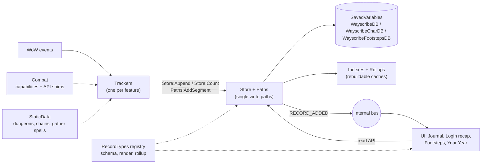

# Wayscribe architecture

How Wayscribe is built, and why. Wayscribe is an automatic, per-character journal for **WoW
Forever**: it records what happens while you play, groups it by day, and powers a login recap, the
**Footsteps** travel map and **Your Year**, a yearly recap. Next to what it records, the player keeps
their own **notes** in it, and a note can mark a place on the world map. What it does for players is in the
[README](../README.md); how to run the tests and try a build is in [DEVELOPMENT.md](DEVELOPMENT.md).

This page is the overview: the design principles and the layers. Each other section has a file of its
own in [architecture/](architecture/), listed in the index below. Code comments cite sections by number
(`docs/ARCHITECTURE.md §4.6`), so the numbers stay put; the index says which file holds a section.

## Sections

| § | File | What's in it |
|---|---|---|
| 1, 2 | this page | Design principles, platform constraints, layers |
| 3 | [03-core.md](architecture/03-core.md) | Lifecycle, modules and events, bus and timing, error boundary, time |
| 4.1–4.7 | [04-data.md](architecture/04-data.md) | SavedVariables split, `WayscribeCharDB` layout, record types, write and read paths, schema and safe mode, size budget |
| 4.8 | [04.8-backup.md](architecture/04.8-backup.md) | The backup string and restoring it |
| 4.9 | [04.9-notes.md](architecture/04.9-notes.md) | The player's notes and their `/way` lines |
| 5 | [05-compat.md](architecture/05-compat.md) | Capability detection, API shims, `/ws probe` |
| 6.1–6.7, 6.9 | [06-trackers.md](architecture/06-trackers.md) | Session, level, professions, gathering, bosses, dungeon runs, quest chains, deaths |
| 6.8 | [06.8-footsteps.md](architecture/06.8-footsteps.md) | Footsteps: sampling, packed trails, the map, coverage |
| 7 | [07-ui.md](architecture/07-ui.md) | Journal, world map, Your Year, export, backup, login recap, settings, minimap, notes |
| 8 | [08-your-year.md](architecture/08-your-year.md) | The yearly recap's cards |
| 9 | [09-repository-layout.md](architecture/09-repository-layout.md) | Files and TOC load order |
| 10 | [10-tooling.md](architecture/10-tooling.md) | Libraries, tests, lint, CI, packaging |
| 11 | [11-roadmap.md](architecture/11-roadmap.md) | Releases and what's next |
| 12 | [12-forever-beta.md](architecture/12-forever-beta.md) | What `/ws probe` verifies on the Forever beta |
| 13 | [13-decisions.md](architecture/13-decisions.md) | Decisions and the reasons for them, by area |

---

## 1. Design principles

These six rules drive every decision in these documents. If a future feature conflicts with one of them, change the
feature, not the rule.

1. **Store facts, derive narratives.** We persist small, typed facts (`LEVEL_UP {level=12}`), never
   finished sentences. Text, "first time" badges, rollups and recaps are computed from facts. This keeps
   the DB small and localizable, and lets a later release reinterpret old data. For example, a new
   quest-chain definition can light up chains that were completed months ago.
2. **One write path.** Trackers never touch SavedVariables. Every journal write goes through `Store`,
   every Footsteps trail through `Paths`; both validate, partition and broadcast what they keep.
3. **Never destroy data you don't understand.** If loading or migrating fails, or the data comes from a
   newer addon version, the addon goes **read-only (safe mode)**. Because the client saves whatever is
   in memory on logout, a crash at load followed by a "fresh start" would wipe the journal. Safe mode
   prevents that.
4. **Detect capabilities, not flavors.** Forever runs the Mainline engine but ships Vanilla content, and
   its `WOW_PROJECT_ID` has already changed once during the beta (1 in early builds, 18 in build 70235).
   Branching on flavor broke AutoPotion (`a70aac7`). Code asks `Compat.has.X`, never `isRetail`.
5. **Pay only for what's enabled.** A disabled tracker unregisters all of its events. Context-only events
   (roster, encounters) are registered only while that context is active, for example inside an instance.
6. **Failures stay local.** Each tracker runs in an error boundary. A broken tracker logs itself, disables
   itself and leaves the rest of the addon running.

### Hard constraints of the platform

| Fact | Consequence for the design |
|---|---|
| SavedVariables (SV) are loaded once before `ADDON_LOADED` and written **only** on clean logout or `/reload`. There is no flush API. | Everything lives in memory during play. A client crash loses that session, and nothing can prevent it. Writes are cheap table inserts. |
| SV files are Lua source parsed at login. Many small tables and unique constants are slow to load, and very large SV files have historically hit `constant table overflow`. | Bulk data (Footsteps trails) is **string-packed**. Records stay compact. Old data can move to a load-on-demand archive. |
| `SavedVariablesPerCharacter` loads only the current character's file. | The journal is per-character by nature, so it gets automatic partitioning for free. |
| Metatables, functions and userdata are not saved. | The SV tables hold plain data only. Behavior lives in modules that read and write those tables. |
| **Confirmed:** registering `COMBAT_LOG_EVENT_UNFILTERED` on Forever triggers a protected-action popup (ForeverChronicle had to remove it). | **Never register CLEU.** Use high-level events such as `ENCOUNTER_END`, `BOSS_KILL`, `PLAYER_LEVEL_UP`, `QUEST_TURNED_IN` and `LOOT_*`. |
| **Confirmed:** Forever has Midnight-style **secret values** (`issecretvalue` exists). Spellcast event arguments, aura data, and some unit, map and quest values can be secret at times. Comparing, concatenating or storing a secret value raises an error. | Every game value passes `Compat.Safe(v)` at the tracker boundary: it returns `nil` for secrets and wrong types. `Store` validation rejects secrets as a second line of defense. A missing value degrades the record, never the session. |
| **Reported:** early Forever beta builds wrote SavedVariables to disk but sometimes didn't restore them at the next startup. According to a Blizzard forum report, this stopped from client build `1.60.1.70009`. | A missing character DB is never silently treated as a first install while there's evidence that data existed (see §4.6, missing-DB guard). The client build is stored in `meta` for diagnosis. |

---

## 2. Layer overview

| Layer | Responsibility | May depend on |
|---|---|---|
| **Core** | Namespace, lifecycle, module base, event frames, internal bus, error boundary, logging, time/day keys, geometry (pure math on trails) | — |
| **Compat** | Capability detection (`Compat.has.*`), thin API shims (position, professions, instance info), `/ws probe` | Core |
| **Data** | `Store`, `Paths` (Footsteps trails), `Notes` (the player's notes), `Schema` (migrations, safe mode), `RecordTypes`, `Index`, `Players` (interning), `Codec`, `Coverage` (share of Azeroth walked), `YearCards` (Your Year's card registry), `Backup` (the restorable backup string) | Core, Compat |
| **StaticData** | Plain tables: dungeon → final encounter, quest chains, gather and travel spell IDs, English map names | — |
| **Trackers** | Translate game events into facts, holding only the minimal state they need | Core, Compat, Data (write API), StaticData |
| **UI** | Journal window with Your Year and Notes, login recap, settings, minimap, keybind, Footsteps map, notes on the map, export, backup and restore | Core, Data (read API, `Notes` to write the player's notes), RecordTypes |

Dependencies point one way only. UI never calls trackers, and trackers never call UI. They talk through
the Store and the bus. The one write the UI makes is the player's own notes, through `Notes` (§4.9).
