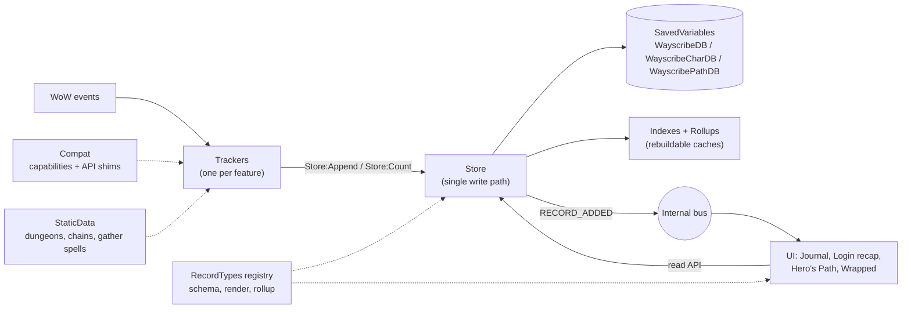

# Wayscribe — Architecture Plan

An automatic, per-character journal for **WoW Forever**. It records what happens while you play,
groups it by day, and powers a login recap, a **Footsteps** travel map (the Hero's Path idea) and a yearly "Wrapped".

> The name **Wayscribe** was decided on 2026-10-06, after checking that it's free on CurseForge, Wago,
> WoWInterface and GitHub. It's baked into the SavedVariables names, the folder name and the slash
> commands.

---

## 1. Design principles

These six rules drive every decision below. If a future feature conflicts with one of them, change the
feature, not the rule.

1. **Store facts, derive narratives.** We persist small, typed facts (`LEVEL_UP {level=12}`), never
   finished sentences. Text, "first time" badges, rollups and recaps are computed from facts. This keeps
   the DB small and localizable, and lets a later release reinterpret old data. For example, a new
   quest-chain definition can light up chains that were completed months ago.
2. **One write path.** Trackers never touch SavedVariables. Every write goes through `Store`, which
   validates, partitions, indexes and broadcasts it.
3. **Never destroy data you don't understand.** If loading or migrating fails, or the data comes from a
   newer addon version, the addon goes **read-only (safe mode)**. Because the client saves whatever is
   in memory on logout, a crash at load followed by a "fresh start" would wipe the journal. Safe mode
   prevents that.
4. **Detect capabilities, not flavors.** Forever runs the Mainline engine but ships Vanilla content, and
   its `WOW_PROJECT_ID` has already changed once during the beta (1 in early builds, 18 in build 70235).
   Branching on flavor broke AutoPotion (`a70aac7`). Code asks `Compat.has.X`, never `isRetail`.
5. **Pay only for what's enabled.** A disabled tracker unregisters all of its events. Context-only events
   (roster, encounters) are registered only while that context is active, for example inside an instance.
6. **Failures stay local.** Each tracker runs in an error boundary. A broken tracker logs itself, disables
   itself and leaves the rest of the addon running.

### Hard constraints of the platform

| Fact | Consequence for the design |
|---|---|
| SavedVariables (SV) are loaded once before `ADDON_LOADED` and written **only** on clean logout or `/reload`. There is no flush API. | Everything lives in memory during play. A client crash loses that session, and nothing can prevent it. Writes are cheap table inserts. |
| SV files are Lua source parsed at login. Many small tables and unique constants are slow to load, and very large SV files have historically hit `constant table overflow`. | Bulk data (Hero's Path points) is **string-packed**. Records stay compact. Old data can move to a load-on-demand archive. |
| `SavedVariablesPerCharacter` loads only the current character's file. | The journal is per-character by nature, so it gets automatic partitioning for free. |
| Metatables, functions and userdata are not saved. | The SV tables hold plain data only. Behavior lives in modules that read and write those tables. |
| **Confirmed:** registering `COMBAT_LOG_EVENT_UNFILTERED` on Forever triggers a protected-action popup (ForeverChronicle had to remove it). | **Never register CLEU.** Use high-level events such as `ENCOUNTER_END`, `BOSS_KILL`, `PLAYER_LEVEL_UP`, `QUEST_TURNED_IN` and `LOOT_*`. |
| **Confirmed:** Forever has Midnight-style **secret values** (`issecretvalue` exists). Spellcast event arguments, aura data, and some unit, map and quest values can be secret at times. Comparing, concatenating or storing a secret value raises an error. | Every game value passes `Compat.Safe(v)` at the tracker boundary: it returns `nil` for secrets and wrong types. `Store` validation rejects secrets as a second line of defense. A missing value degrades the record, never the session. |
| **Reported:** early Forever beta builds wrote SavedVariables to disk but sometimes didn't restore them at the next startup. According to a Blizzard forum report, this stopped from client build `1.60.1.70009`. | A missing character DB is never silently treated as a first install while there's evidence that data existed (see §4.6, missing-DB guard). The client build is stored in `meta` for diagnosis. |

---

## 2. Layer overview



| Layer | Responsibility | May depend on |
|---|---|---|
| **Core** | Namespace, lifecycle, module base, event frames, internal bus, error boundary, logging, time/day keys | — |
| **Compat** | Capability detection (`Compat.has.*`), thin API shims (position, professions, instance info), `/wayscribe probe` | Core |
| **Data** | `Store`, `Schema` (migrations, safe mode), `RecordTypes`, `Index`, `Players` (interning), `Codec` | Core |
| **StaticData** | Plain tables: dungeon → final encounter, quest chains, gather spell IDs | — |
| **Trackers** | Translate game events into facts, holding only the minimal state they need | Core, Compat, Data (write API), StaticData |
| **UI** | Journal window, login recap, settings, minimap, keybind, Hero's Path overlay, Wrapped | Core, Data (read API), RecordTypes |

Dependencies point one way only. UI never calls trackers, and trackers never call UI. They talk through
the Store and the bus.

---

## 3. Core runtime

### 3.1 Lifecycle

| Event | What happens |
|---|---|
| `ADDON_LOADED` (ours) | `Schema:Load()` creates or migrates the three SV tables, decides on safe mode and builds the in-memory indexes. |
| `PLAYER_LOGIN` | Resolve `Compat` capabilities. Enable each tracker whose setting is on. Register settings, minimap button and slash commands. |
| `PLAYER_ENTERING_WORLD(isInitialLogin, isReloadingUi)` | The Session tracker starts or resumes a session. The login recap is shown if this is the initial login and the first one of the day. |
| `PLAYER_LOGOUT` | Close open sessions, segments and runs, and stamp `lastSeen`. This handler must be tiny and must not error, because it is the last chance to write before the SV file is saved. |

### 3.2 Modules and event dispatch

- A **Module** base class gives each tracker its own hidden event frame plus
  `self:RegisterEvent(ev)`, `self:RegisterUnitEvent(ev, "player")` and `self:UnregisterAllEvents()`.
  The client dispatches natively, so we don't need a central fan-out loop. With per-module frames,
  `RegisterUnitEvent` filters never collide.
- Handlers are `self[event](self, ...)`, called through `xpcall` with our error handler, which feeds the
  [error boundary](#34-error-boundary).
- Use `RegisterUnitEvent(..., "player")` for every `UNIT_*` event. Otherwise the event fires for every
  nameplate and party member.
- Trackers with **context-scoped events** subscribe on context enter and unsubscribe on context exit.
  For example, the Dungeon tracker registers `ENCOUNTER_END` and `GROUP_ROSTER_UPDATE` only while inside
  an instance.

### 3.3 Internal bus and deferral

- Tiny callback registry (or CallbackHandler-1.0). Messages: `RECORD_ADDED`, `COUNTER_CHANGED`,
  `DAY_CHANGED`, `SETTINGS_CHANGED`, `SAFE_MODE`.
- `ns.Defer(fn)`: work that doesn't need to happen in combat (UI refresh, index maintenance beyond O(1),
  loading the archive) is queued and flushed on `PLAYER_REGEN_ENABLED`.
- UI refresh is **coalesced**: a dirty flag plus one `C_Timer.After(0, ...)`, so 20 loot events produce
  one redraw.
- Noisy events (`SKILL_LINES_CHANGED`, `BAG_UPDATE`) are **debounced**: snapshot once, ~0.5 s after the
  burst.

### 3.4 Error boundary

- Errors are written to a ring buffer in `WayscribeDB.log` (last 50 entries, each with timestamp, module,
  message and trimmed stack). The `/wayscribe log` command shows them.
- A module that errors 10 times in one session is disabled for the rest of the session, with a single
  chat notice.
- In dev mode (`/wayscribe dev`), errors are also forwarded to `geterrorhandler()` so BugSack sees them.

### 3.5 Time

- All timestamps are `time()` epoch seconds.
- Day key: integer `YYYYMMDD` (`20261003`). Month key: `YYYYMM`. Both are computed from local time when
  the record is written. Days roll over at **calendar midnight** (decided). There's no configurable
  rollover hour, so a day key never depends on a setting.
- Display format is a setting: locale default (deDE → `03.10.2026`) or a manual override.

---

## 4. Data layer

The data layer is the most important part of the addon and gets the most tests.

### 4.1 SavedVariables split

| SV | Scope | Contents | Why separate |
|---|---|---|---|
| `WayscribeDB` | Account | Settings, minimap position, error log, per-character canaries (§4.6) | Small. Shared across characters. A separate file, so it can vouch for the character files. |
| `WayscribeCharDB` | Character | Journal records, counters, sessions, indexes, tracker state | The core data. |
| `WayscribePathDB` | Character | Hero's Path segments (string-packed) | The largest and fastest-growing data. Isolating it means it can be wiped, pruned or moved to load-on-demand without touching the journal. |

### 4.2 `WayscribeCharDB` layout

```lua
WayscribeCharDB = {
    schema = 1,                         -- migration version (see 4.6)
    meta = {
        guid = "Player-…", name = "…", realm = "…", class = "MAGE", race = "Troll",
        created = 1759400000,           -- first time the addon saw this character
        seq = 1234,                     -- last issued record id (monotonic)
        addonVersion = "0.2.0",         -- last version that wrote this DB
        lastRecapDay = 20261003,        -- login popup bookkeeping
    },

    -- Resumable tracker state (survives /reload and relog)
    state = {
        session     = { start = 1759490000, resumed = 0 },
        professions = { [186] = 52, [182] = 31 },          -- skillLineID -> rank (snapshot)
        activeRun   = { instanceID = 389, start = 1759490500,
                        roster = { 3, 7 }, bosses = { 1, 2 } },
    },

    -- Interned players (records hold small integers instead of names)
    players = {
        [3] = { guid = "Player-…", name = "Xy", realm = "…", class = "PRIEST" },
    },

    -- Partitioned journal: month -> day -> records + counters
    months = {
        [202610] = {
            days = {
                [20261003] = {
                    records = {
                        { id = 1201, ts = 1759490900, type = "DUNGEON_COMPLETED", v = 1,
                          data = { instanceID = 389, roster = { 3, 7 }, dur = 2710 }, first = true },
                        { id = 1202, ts = 1759493100, type = "LEVEL_UP", v = 1,
                          data = { level = 12, map = 1411 } },
                    },
                    counters = {                  -- high-frequency facts are aggregated, not listed
                        gather = { [2770] = 23, [2835] = 4 },     -- itemID -> count
                        nodes  = { mining = 12 },
                        quests = { 840, 841, 788 },               -- questIDs turned in today
                    },
                },
            },
            sessions = { { s = 1759489000, e = 1759497000 } },
            rollup   = { levelsGained = 2, dungeons = { [389] = 1 }, bosses = 4,
                         gather = { [2770] = 23 }, companions = { [3] = 1, [7] = 1 },
                         playSeconds = 8000, activeDays = 1 },
        },
    },

    firsts = { ["DUNGEON:389"] = 1201, ["PROF:186"] = 1103 },   -- first-occurrence index
}
```

Why this shape:

- **Month and day partitions** keep every read and write bounded. Rendering a day touches one table.
  The yearly recap touches 12 rollups. Moving a closed year into an archive moves whole month tables,
  with no per-record migration.
- **Records vs counters.** A *record* is something worth its own journal line, such as a level-up, a
  dungeon or a boss. A *counter* is something that happens a lot, such as ore looted or quests turned in.
  Counters are summed per day and shown as one summary line ("Gathered 23× Copper Ore, 4× Rough Stone").
  This keeps the DB small. The rule of thumb: a new tracker that would emit more than ~20 records per hour
  should use counters.
- Records carry `v` (the record-type version) so renderers can handle or upcast older shapes.
- **Player interning:** dungeon groups repeat, and a small integer is much cheaper than a name or GUID
  repeated in every record. It also makes "top companions" a simple count.

### 4.3 Record types: the extension point

Every record type is registered once, and that registration is its contract:

```lua
ns.RecordTypes:Register("DUNGEON_COMPLETED", {
    version  = 1,
    category = "adventure",               -- journal filter group
    fields   = { instanceID = "number", roster = "table", dur = "number?" },
    firstKey = function(data, r) return "DUNGEON:" .. data.instanceID end,  -- enables "First time" badge
    rollup   = function(monthRollup, data, r) ... end, -- O(1) update of the month rollup
    merge    = function(yearRollup, monthRollup) ... end, -- combines type-specific rollup fields
    render   = function(data, r) ... end,  -- -> text, icon (localized, at display time)
    upcast   = { [1] = function(data) ... end },  -- optional: version 1 shape -> version 2
})
```

The Store uses `fields` to validate (strict in dev mode, cheap type checks in release), plus `firstKey`
and `rollup` to maintain indexes. The UI uses `render`. Neither layer has a per-type `if/else`.

### 4.4 Write path

```lua
Store:Append(type, data [, opts])   -- milestone record; returns the record
Store:Count(path, key, n)           -- counters: Store:Count("gather", itemID, 3)
Store:SetState(tracker, tbl)        -- resumable tracker state
```

`Append` runs these steps, each O(1):

1. Refuse if in safe mode.
2. Look up the record type. An unknown type is a programming error and is logged.
3. Build the record: `id = ++meta.seq`, `ts`, `v`.
4. Validate.
5. Optionally check `opts.dedupeKey` against a small in-memory recent-keys set. This guards against
   double-firing events (`ENCOUNTER_END` plus `BOSS_KILL`), and against trackers replaying state after
   a `/reload`.
6. Insert into `months[m].days[d].records`.
7. Update `firsts` (and set `r.first = true` if new), the month rollup and the in-memory day index.
8. Fire `RECORD_ADDED`.

### 4.5 Read path

```lua
Store:GetDayKeys()                    -- sorted array (built in memory at load, never persisted)
Store:GetDay(dayKey)                  -- records (time-sorted) + counters
Store:GetSessions(fromTs, toTs)
Store:GetMonthSummary(ym) / Store:GetYearSummary(y) -- rollups + play time; year = sum of 12 months
Store:GetFirst(key)
```

- The day index is rebuilt at load from month and day keys. That costs a few hundred iterations per year
  of data, so there's nothing to persist or corrupt.
- `firsts` and `rollup` **are** persisted for speed, but they are treated as caches. `/wayscribe rebuild`
  (and any migration that needs it) recomputes them from records and counters. A rollup schema change is
  therefore just "bump version and rebuild".
- The journal UI asks only for the days that are visible, so the ScrollBox is virtualized.

### 4.6 Schema, migrations, safe mode

```text
ADDON_LOADED
 ├─ DB missing, canary says data existed → SAFE MODE + warning (don't overwrite; see guard below)
 ├─ DB missing             → create fresh at CURRENT_SCHEMA
 ├─ db.schema > CURRENT    → SAFE MODE (data from a newer addon version — never downgrade-write)
 └─ db.schema < CURRENT    → for v = schema+1 .. CURRENT:
                                ok = pcall(migrations[v], db)   -- builds new tables, swaps at end
                                if not ok → SAFE MODE, log, stop
```

- Migrations are **build-then-swap**. They construct the new structure off to the side and assign it at
  the end, so a failure never leaves the DB half-mutated. They are idempotent, and each one has a fixture
  test (old shape → new shape).
- In **safe mode**, trackers stay disabled, the journal is read-only (if the data was readable), a banner
  explains the problem, and `/wayscribe log` shows the error. The SV table is left exactly as it was loaded,
  so logout writes back the same data. The client also keeps `<Addon>.lua.bak` as a one-step backup.
- If `meta.guid` doesn't match `UnitGUID("player")` (for example, a WTF folder copied to another
  character), the journal is shown read-only until the player confirms with `/ws accept`.
- **Missing-DB guard.** The account-wide `WayscribeDB.characters[guid]` keeps a tiny canary per
  character: name, realm, last `seq`, last save time. It's written to a different SV file than the
  journal.
  - If the character DB loads as `nil` or empty but the canary shows records, the journal file
    failed to load (or was moved). The addon goes into safe mode, records nothing, and warns the
    player right away. An addon can't stop the client from rewriting the file at logout, but the
    file on disk is still intact during this session. The warning says to copy
    `WTF/…/SavedVariables/Wayscribe.lua` (or its `.bak`) somewhere safe **before logging out**.
  - The same canary detects **renames and realm transfers**. Per-character SV files are stored under
    the character name, so a renamed character starts with an empty file. Wayscribe recognizes the
    GUID and shows how to move the old file.
  - This doesn't help if *every* SV file fails to load (canary and journal look like a first
    install), so an export or backup option stays on the roadmap.
- Migrations need **no persistent snapshot inside the SV**. Build-then-swap happens in memory, so if
  the client crashes before saving, the old file is still on disk and the migration simply runs again
  next login. (ForeverChronicle keeps a full DB copy inside its SV during migrations, which doubles
  the file size. This design avoids that.)

### 4.7 Size budget and growth plan

Estimates for an active player (about 2 h/day):

| Data | Per day | Per year | Notes |
|---|---|---|---|
| Journal records + counters | ~2–4 KB | ~1 MB | 20–50 records/day, counters aggregated |
| Hero's Path (packed, simplified) | ~3–6 KB | ~1–2 MB | See §6.8 |
| Indexes / rollups | — | < 50 KB | Months × small tables |

That's roughly 2–3 MB per character per year, which is comfortable for a few years. The growth plan is
designed now but built later:

- **Phase A (v1):** everything lives in the main addon. Partition keys are already month-based.
- **Phase B (when real data says so):** a load-on-demand companion, `Wayscribe_Archive`, with its own
  per-character SV. Once a month, out of combat at login, closed **years** (and Hero's Path months older
  than N) move from the hot DB into the archive. Browsing an archived year runs
  `C_AddOns.LoadAddOn("Wayscribe_Archive")` on demand. Because rollups stay in the hot DB, the yearly recap
  never needs the archive.
- `/wayscribe stats` reports record counts and approximate serialized size per SV, so we can decide when to
  build Phase B from real numbers.

---

## 5. Compat layer

`Compat` runs once at `PLAYER_LOGIN` and exposes:

```lua
Compat.has = {
    encounterEvents = …,   -- ENCOUNTER_END fires for dungeon bosses
    questLines      = …,   -- C_QuestLine.GetQuestLineInfo returns data for Vanilla quests
    unitPosition    = …,   -- UnitPosition("player") works outdoors
    mapWorldPos     = …,   -- C_Map.GetWorldPosFromMapPos / GetMapPosFromWorldPos
    professionsAPI  = …,   -- GetProfessions/GetProfessionInfo (Mainline) vs GetSkillLineInfo (Classic)
    settingsAPI     = …,   -- Settings.RegisterVerticalLayoutCategory
    lootSourceInfo  = …,   -- GetLootSourceInfo
}
Compat.Safe(v [, expectedType])  -- -> v, or nil if issecretvalue(v) or the type is wrong. Every game value goes through this.
Compat.Call(fn, ...)             -- pcall + Safe on each return value, for APIs that may error or return secrets
Compat.GetPlayerWorldPosition()  -- -> continentID, x, y   (nil in instances)
Compat.GetProfessionSnapshot()   -- -> { [skillLineID] = { rank, max, name } }
Compat.GetInstance()             -- -> instanceID, type, difficultyID, name
Compat.GetGroupMembers()         -- -> array of { guid, name, realm, class }
```

**`/wayscribe probe`** prints a capability report (which APIs exist and what they return right now). We run
it on the Forever beta and paste the result into `docs/forever-probe.md`. Every "verify on beta" item in
§12 maps to one probe line.

---

## 6. Trackers (v1 feature set)

Each tracker is one file containing its record types, its event handling, its settings label and
default. **Adding a feature = one file + locale strings + one TOC line.** The settings page builds its
toggle automatically from the tracker registry.

```lua
-- The shape of a tracker file (simplified from Trackers/Level.lua)
local _, ns = ...
local L, Compat, Store = ns.L, ns.Compat, ns.Store

ns.RecordTypes:Register("LEVEL_UP", {
    version = 1, category = "progress",
    fields  = { level = "number", map = "number?" },
    rollup  = function(rollup, data) rollup.maxLevel = math.max(rollup.maxLevel or 0, data.level) end,
    render  = function(data) return L.LEVEL_UP:format(data.level) end,
})

local Level = ns.Trackers:New("Level", { label = L.TRACKER_LEVEL })

function Level:OnEnable() self:RegisterEvent("PLAYER_LEVEL_UP") end

function Level:PLAYER_LEVEL_UP(newLevel)
    local level = Compat.Safe(newLevel, "number")   -- secret or wrong type -> nil
    if level then
        Store:Append("LEVEL_UP", { level = level, map = Compat.GetPlayerMapID() })
    end
end
```

The real file also keeps a saved `level` state, so duplicate or replayed events can't create a
second entry, and it falls back to `UnitLevel` when the event argument is secret.

### 6.1 Session (always on, internal)
- Initial login opens a session. On `/reload` (`isReloadingUi`), the session is resumed. Logout stamps
  `e`.
- Produces `months[m].sessions` and `playSeconds` in the rollup. This drives the login recap and the
  "most active day" stat in Wrapped.

### 6.2 Level ups
- `PLAYER_LEVEL_UP(level)` → `LEVEL_UP {level, map}`.

### 6.3 Professions (learn + skill gains)
- **Snapshot-diff pattern.** On `SKILL_LINES_CHANGED`, `CHAT_MSG_SKILL` (used only as a trigger; the
  text is never parsed, so it works in every locale) and `TRADE_SKILL_LIST_UPDATE`, take a debounced
  snapshot with `Compat.GetProfessionSnapshot()`, diff it against `state.professions`, and save the new
  snapshot.
- New skill line → `PROFESSION_LEARNED {skillLine}` (milestone, `firstKey`).
- Rank crossings 75/150/225/300 → `PROFESSION_RANK {skillLine, rank}` (milestone).
- Every point gained → `Store:Count("skill", skillLine, delta)`. The day view shows
  "Mining +23 (52 → 75)".
- Because the snapshot is persisted, changes made while the addon was disabled are reconciled at the
  next login without duplicates.

### 6.4 Gathering (ores, herbs, skins)
- `UNIT_SPELLCAST_SUCCEEDED` (registered for `"player"` only) with a gather spell from
  `StaticData/Gathering.lua` opens a **gather window** of about 5 s, tagged as mining, herb or skinning.
- `LOOT_READY` inside that window snapshots the loot slots (`GetLootSlotLink`, plus `GetLootSourceInfo`
  to confirm the source is a node or a creature). `LOOT_SLOT_CLEARED` counts only what was actually
  looted, so full bags don't inflate the numbers.
- Output is counters only: `Store:Count("gather", itemID, qty)` and `Store:Count("nodes", kind, 1)`.
  Item categories come from `C_Item.GetItemInfoInstant` class and subclass IDs (Metal & Stone, Herb,
  Leather), which are locale-free.

### 6.5 Boss kills
- `ENCOUNTER_END(encounterID, name, difficultyID, groupSize, success)` with `success == 1` →
  `BOSS_KILLED {encounterID, instanceID, roster}` with `firstKey = "BOSS:"..encounterID`.
- `dedupeKey = "boss:"..encounterID..":"..runStart` protects against double events and reloads.

### 6.6 Dungeon runs
- A state machine driven by `PLAYER_ENTERING_WORLD` and `ZONE_CHANGED_NEW_AREA` plus
  `Compat.GetInstance()`.
  - **Enter a party instance:** start or resume `state.activeRun`. It resumes if the instanceID is the
    same and less than 30 min has passed since we left, which covers reloads, disconnects and corpse
    runs. Register `ENCOUNTER_END` and `GROUP_ROSTER_UPDATE`.
  - **Roster:** the union of group members present at any boss kill, interned through `Players`.
  - **Completion:** the instance's final encounter from `StaticData/Dungeons.lua` was killed →
    `DUNGEON_COMPLETED {instanceID, roster, dur, bosses}` with `firstKey`. Optional extra signals, used
    only if Forever has them: `LFG_COMPLETION_REWARD` and `SCENARIO_COMPLETED`.
  - **Leave without the final boss:** `DUNGEON_VISITED {instanceID, bosses killed}`. This also covers
    dungeons we don't have data for yet: missing data degrades to "visited", it never causes an error.
- The renderer turns these records into "First time Ragefire Chasm with Xy, Ab, Cd".

### 6.7 Quest chains
Pluggable **chain providers**, tried in order:

1. `C_QuestLine` (if `Compat.has.questLines`): on turn-in, look up the questline. If this quest is the
   last one in the line, the chain is complete.
2. **Curated data** (`StaticData/QuestChains.lua`) for well-known Vanilla chains (class quests,
   attunements, famous storylines), keyed by the final questID.

- Every `QUEST_TURNED_IN` also does `Store:Count("quests", …)` (the questID list per day), because that's
  a cheap fact.
- That list makes chains **retroactive**: when a later release adds chain definitions, `/wayscribe rebuild`
  scans the stored questIDs and back-fills `QUEST_CHAIN_COMPLETED` records with the correct dates.
- The record is `QUEST_CHAIN_COMPLETED {chainID | questLineID, finalQuestID, title}`. The title is
  captured at turn-in, while the quest log has it.

### 6.8 Hero's Path

Two data products. Trails are the source of truth; coverage is derived from them.

**Sampling.** A `C_Timer.NewTicker(1)` runs only while the feature is on, the player is outdoors and the
player is not dead or a ghost. It doesn't use `OnUpdate`.
- `Compat.GetPlayerWorldPosition()` → `continentID, x, y` in world yards. World coordinates are
  independent of any one map, so the same trail renders on zone, continent and world maps.
- Keep a point only if it is more than 8 yards from the last kept point. A standing player costs one API
  call per second and writes nothing.
- A **segment** closes on continent change, taxi start or end (flight segments are flagged and drawn
  differently), entering an instance, more than 60 s idle, or logout.
- When a segment closes, it is simplified with **Douglas-Peucker** (tolerance about 3 yards) and then
  encoded.

**Storage** (`WayscribePathDB.months[YYYYMM]`):
```lua
{ c = 1, t = 1759490000, d = 640, f = nil, p = "Bx3_a9…" }   -- continent, start, duration, flight, points
```
- `p` is a **polyline codec**: quantize to whole yards, delta-encode, zigzag, then write as varints in a
  64-character printable alphabet.
- The codec uses arithmetic only (no `bit` library), so it is unit-testable in plain Lua 5.1.
- A segment of 500 points packs into about 1.5 KB as **one string constant**, instead of 500 tables.

**Coverage** (the "% explored" stat and the fog-of-war look) is rasterized from the trails into chunked
bitsets in a coroutine spread across frames, and cached in memory. It is persisted only if profiling
shows we need it.

**Rendering** (v1): a `MapCanvas` data provider on `WorldMapFrame`, the official extension point that
HandyNotes also uses.
- World coordinates are converted to the displayed map with `C_Map.GetMapPosFromWorldPos`, then drawn
  with pooled `Line` textures.
- The point count per map is capped through simplification tolerance (level of detail) based on map
  scale.
- Filters: Today, This week, All, or a specific day. The journal's day page has a **"Show this day's
  path"** button.

---

## 7. UI

| Piece | Design |
|---|---|
| **Journal window** | Movable, resizable frame. Left: virtualized day list (`ScrollBox` + `DataProvider`), newest first. Right: the selected day's page, with milestones in time order, then counter summaries, then sessions. Category filter chips. Tabs: **Journal · Footsteps · Wrapped · Stats**. |
| **Login recap** | On `isInitialLogin` and `meta.lastRecapDay ~= today`, show the last session: date, duration, rendered milestones and counter summary. Buttons: *Open journal*, *Close*, and a *Don't show again* checkbox wired to the setting. Setting `showLoginRecap` defaults to **on**. |
| **Settings** | Blizzard `Settings` API, using `RegisterVerticalLayoutCategory` with `RegisterAddOnSetting` and `CreateCheckbox`. Sections: **General** (login recap, date format, minimap button), **Tracking** (one toggle per tracker, generated from the registry), **Hero's Path** (enable, record flights), **Data** (stats, rebuild indexes, debug log, reset with confirmation). |
| **Minimap button** | LibDataBroker-1.1 + LibDBIcon-1.0 (drag, hide toggle, Addon Compartment entry). Placeholder icon: `Interface\Icons\INV_Misc_Book_09`. Left-click toggles the journal, right-click opens settings. |
| **Keybind** | `Bindings.xml`: `WAYSCRIBE_TOGGLE` under the AddOns category, unbound by default and configurable in the game's Keybindings menu. `BINDING_HEADER_WAYSCRIBE` and `BINDING_NAME_WAYSCRIBE_TOGGLE` are localized. |
| **Slash** | `/wayscribe` or `/ws` (toggle), plus `probe`, `stats`, `log`, `rebuild`, `dev`, `simulate <TYPE> …`, `accept`. |
| **Wrapped** | See §8. |

All UI listens to bus messages. None of it polls.

---

## 8. Yearly recap ("Wrapped")

- Data comes from `Store:GetYearSummary(year)` (12 month rollups), plus `firsts` and Hero's Path coverage.
  It's cheap and needs no archive.
- It's shown as a card slideshow (next and previous). Cards include:
  - Levels gained (from → to) and the day you hit max level
  - Dungeons cleared, with your most-run dungeon and its first clear date
  - Bosses defeated
  - Top 3 companions (most shared runs)
  - Ores, herbs and skins totals, plus the top item
  - Professions learned and maxed
  - Quest chains completed
  - Distance traveled and % of Azeroth walked (Hero's Path)
  - Most active month and day, and total play time
- It becomes available from December 1st, with a one-time "Your 2026 is ready" prompt. It can also be
  opened any time from the tab for any past year.
- New cards plug in through a `RecapCards:Register{ id, order, build = function(yearRollup) … end }`
  registry. It's the same extension pattern as trackers.

---

## 9. Repository layout

```text
Wayscribe.toc
Bindings.xml
embeds.xml                 -- libs (fetched by the packager via .pkgmeta)
Locales/   enUS.lua deDE.lua Locales.xml
Core/      Init.lua Log.lua Time.lua Bus.lua Module.lua Trackers.lua
Compat/    Compat.lua Probe.lua
Data/      Schema.lua Migrations.lua RecordTypes.lua Store.lua Index.lua Players.lua Codec.lua
StaticData/ Dungeons.lua QuestChains.lua Gathering.lua
Trackers/  Session.lua Level.lua Professions.lua Gathering.lua Bosses.lua Dungeons.lua
           QuestChains.lua HeroPath.lua
UI/        Theme.lua Journal.lua DayView.lua LoginRecap.lua Settings.lua Minimap.lua
           HeroPathMap.lua Wrapped.lua
tests/     run.lua wow_stubs.lua codec_spec.lua store_spec.lua schema_spec.lua index_spec.lua …
docs/      ARCHITECTURE.md forever-probe.md
.pkgmeta  .luacheckrc  .github/workflows/{ci.yml,release.yml}
```

TOC essentials:

```text
## Interface: 16001
## Title: Wayscribe
## Notes: An automatic journal of your character's adventures.
## Author: ollidiemaus
## Version: @project-version@
## SavedVariables: WayscribeDB
## SavedVariablesPerCharacter: WayscribeCharDB, WayscribePathDB
# (WayscribePathDB is added in 0.4)
## IconTexture: Interface\Icons\INV_Misc_Book_09
## AddonCompartmentFunc: Wayscribe_OnAddonCompartmentClick
```

The load order in the TOC is Core → Compat → Data → StaticData → Trackers → UI. Load order is the only
dependency mechanism in WoW, so it must match the layer diagram.

---

## 10. Libraries and tooling

- **Libraries (minimal):** 0.1 ships with **no external libraries**. Localization is a small in-house
  table (`Locales/*.lua`). LibStub, CallbackHandler-1.0, LibDataBroker-1.1 and LibDBIcon-1.0 arrive
  with the minimap button in 0.2.
  - No AceDB: the Store has requirements AceDB doesn't cover (partitioning, migrations, safe mode).
  - No AceAddon: the Module base is about 60 lines.
  - No AceLocale: two locales don't need it. Revisit if CurseForge community translations are wanted.
- **Static checks:** `luacheck` with a WoW globals list. The `.vscode` Lua settings come from AutoPotion.
  Keep UI builder functions small: Lua 5.1 allows at most 60 upvalues per function, and ForeverChronicle
  shipped a window that failed to load because of it.
- **Unit tests:** a dependency-free runner (`lua tests/run.lua`) with `tests/wow_stubs.lua` (fake clock,
  `CreateFrame` that can fire events, `C_Timer`, `issecretvalue`). It runs on Lua 5.1 in CI and on any
  local Lua 5.1+. Codec, Store, Schema/migrations, Index rebuild, Players interning, trackers and
  renderers are all exercised, so this is where "very stable read/write" gets proven. A test-only
  serializer round-trips the DB the way the client writes SavedVariables, which proves it holds plain
  data only. Migration tests use frozen fixture DBs from every past schema.
- **CI:** `ci.yml` runs luacheck and the tests on Lua 5.1 on every push and PR. `release.yml` is the
  BigWigsMods packager on tags, as in your other addons. `package-as: Wayscribe` keeps the folder name
  capitalized to match `Wayscribe.toc`, since the repository is the lowercase `wayscribe`.
- **In-game dev tools:** `/ws simulate LEVEL_UP level=12` (developer mode only) injects records through the real write path,
  flagged as test data and removable with `/ws simulate clear`,
  `/wayscribe stats`, `/wayscribe log`, `/wayscribe probe`, and `/wayscribe rebuild`.

---

## 11. Roadmap

| Release | Scope | Exit criteria |
|---|---|---|
| **0.1 Foundation** | Scaffolding, Core, Compat + probe, Data layer (Store, Schema, RecordTypes, Index, Players, Codec) with tests. Session + Level trackers. Bare journal list. Slash commands. | Tests green. Probe report from the Forever beta committed. A level-up survives logout, `/reload` and relog with no duplicates. |
| **0.2 Adventurer** | Professions, Gathering, Bosses, Dungeons (roster + firsts). Settings page, minimap button, keybind, login recap. | A full Ragefire Chasm run produces the expected entries, including after a mid-run `/reload`. |
| **0.3 Chronicler** | Journal UI polish (book look, filters, day view), quest chains (providers + retroactive rebuild), dates localized deDE/enUS. | A curated chain added after the fact back-fills correctly. |
| **0.4 Footsteps** | Sampler, segmenting, simplification, codec, world-map overlay, day → path link. | 2 h of play stays under ~10 KB packed. No measurable frame-time cost. |
| **0.5 Wrapped** | Recap cards, December prompt. Text export of the journal (a backup the player keeps outside WoW). Archive (Phase B) if `/wayscribe stats` from real users justifies it. | The recap renders from rollups alone. |

**Future tracker ideas** (each is a single-file addition): deaths, gold earned and spent, reputation
milestones, first mount, zones discovered, epic loot, talent milestones, PvP honor kills, guild join,
screenshots (`SCREENSHOT_SUCCEEDED` → "took a screenshot here").

---

## 12. Verify on the Forever beta (run `/ws probe`)

The first probe ran on client `1.60.1` build `70235` (2026-10-06). The raw output is in
[forever-probe.md](forever-probe.md). "Exists" means the API or event is there. Whether an event
actually *fires* for Vanilla content still needs the matching gameplay test.

| # | Question | Probe (build 70235) | Still open | Fallback if "no" |
|---|---|---|---|---|
| 1 | Do `ENCOUNTER_END` / `BOSS_KILL` fire for Vanilla dungeon bosses? | Both events exist. ForeverChronicle uses both and merges duplicates. | Kill a dungeon boss (0.2). | NPC-ID detection via `UNIT_HEALTH` on the current target (CLEU is not an option, §1). |
| 2 | Which profession API works? | ✅ `GetProfessions` / `GetProfessionInfo` (modern). | Values with a profession learned (the test character had none). | — |
| 3 | Does world position work outdoors? | ✅ `UnitPosition` works (instance 1 = Kalimdor). ✅ `C_Map.GetWorldPosFromMapPos` returns the same point. **UnitPosition's first return equals the world vector's `.x`.** | Behavior inside instances. | Zone-relative `uiMapID + x,y`. |
| 4 | Does `C_QuestLine` return data for Vanilla quests? | `C_QuestLine.GetQuestLineInfo` exists. | Call it for a Vanilla chain quest (0.3). | Curated chains only. |
| 5 | Which values are secret, and when? | `issecretvalue` exists. `UnitLevel` is not secret out of combat. ForeverChronicle saw secret aura data and spellcast arguments. | Values in combat and instances. | `Compat.Safe` everywhere. Capture IDs and resolve names later via `ns.Defer`. |
| 6 | Gather spell IDs, and does `GetLootSourceInfo` exist? | ✅ `GetLootSourceInfo` exists. | Gather spell IDs (0.2). | Spell-name match plus item subclass classification. |
| 7 | Does an LFG or dungeon-finder completion event exist? | `LFG_COMPLETION_REWARD` and `SCENARIO_COMPLETED` exist. | Whether they fire for Vanilla dungeons. | Final-boss data table (already the primary signal). |
| 8 | Do SavedVariables survive a round trip on the current client build? | ✅ Account and character files written on `/reload` and logout, `.bak` holds the previous save, the session was resumed after the reload. | A full relog (should add a second session). Retest on every new client build. | Missing-DB guard (§4.6). |

Other findings:
- `WOW_PROJECT_ID` is **18** on build 70235. Earlier beta builds reported 1 (Mainline), as recorded in
  AutoPotion. Code never branches on it.
- ScrollBox, the Settings API and the Addon Compartment are all available, so 0.2 and 0.3 can use them.

---

## 13. Decisions

### Decided (2026-10-06)

- **Flavor scope:** Forever only for now. The TOC declares `## Interface: 16001`. The capability-based
  Compat layer still keeps other flavors cheap to add later.
- **Day boundary:** calendar midnight in local time (§3.5). A session that runs past midnight
  continues on the next day's page.
- **Name:** Wayscribe. SVs `WayscribeDB` / `WayscribeCharDB` / `WayscribePathDB`, slash
  `/wayscribe` (alias `/ws`). "Diary" was taken on CurseForge.
- **Companion names:** stored and shown. There's no "hide names" toggle for now.

- **Travel map name:** **Footsteps** (in-game label). "Hero's Path" is taken by another addon and
  is Nintendo's term. Code and SV keep the internal name `HeroPath`.

### Landscape (for positioning)

| Addon | Overlap | Gap we fill |
|---|---|---|
| **ForeverChronicle** (Forever + Retail, created late Sep 2026, ~300 downloads, All Rights Reserved) | Session/day/month/year diary in narrative prose, login recap, levels, quests, dungeons, bosses, gathering, professions, deaths, companions, minimap, slash | No movement trail, no quest-chain completion, no Wrapped-style stats recap, no keybinding, no Blizzard Settings panel. One account-wide SV with flat, unpartitioned event lists that store prose; its own preflight rates performance at 100k+ events 5/10. Its focus is a broad "memory" (search, resource atlas, vendors, trainers, notes, bags and bank), not a journal. |
| AutoBiographer (Classic/TBC, ~109K downloads) | Milestones and stats | No Forever support, no day-by-day journal, no travel map, no yearly recap |
| Hero's Path (Classic 1.15.5, inactive ~1 year) | Route recording | Not combined with a journal, not on Forever |
| Diary (abandoned) | Diary-style tracking | Dead project |
| AdventureHistory, CrossPaths (Retail) | Run logs, social tracking | Retail only, different focus |

**Positioning.** Wayscribe should *not* chase ForeverChronicle's breadth (search engine, resource
atlas, vendor and trainer memory, bag and bank). It should win on three things ForeverChronicle doesn't
have:

1. A **Footsteps trail map** (BotW-style), tied to journal days.
2. A **Wrapped** yearly recap.
3. A **lightweight, scalable core**: per-character partitioned storage, facts instead of prose,
   counters for high-volume events, and native Settings panel plus keybinding.

Its code is All Rights Reserved and forbids public derivative releases, so we take **no code, text,
icons or locale strings** from it. We only use the observable facts about which Forever APIs and
events work, which are listed in §12.
